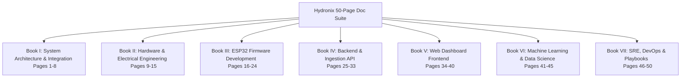

# Hydronix: 50-Page Documentation Plan

This document provides a highly structured, page-by-page plan for a comprehensive 50-page technical manual and system documentation suite for the Hydronix Smart Water Monitoring and Management Platform. It is designed to act as a roadmap for technical writers, developers, hardware engineers, and systems administrators to write the actual pages.

---

## Document Map Summary

---

## Book I: System Architecture & Integration (Pages 1–8)
*Focus: Overall system design, integration boundaries, database schemas, and end-to-end data security.*

### Page 1: Executive Summary & System Overview
*   **Primary Audience:** System Architects, Product Managers, Stakeholders
*   **Objectives:** Introduce Hydronix, its core features, and its full-stack architecture.
*   **Reference Files:** [README.md](file:///c:/Users/harik/OneDrive/Desktop/Git/Thanni-can-poda-vandhan-sir/README.md)
*   **Topics to Cover:**
    *   One-line pitch & business value.
    *   Core system components: Edge Devices, Ingestion Server, ML Service, Web Dashboard.
    *   Physical architecture layout and network topologies.
*   **Visuals Required:** High-level system blocks diagram.

### Page 2: System-Wide Data Flow & Protocols
*   **Primary Audience:** Integration Engineers, Network Administrators
*   **Objectives:** Define transport protocols and detailed packet lifecycles.
*   **Reference Files:** [Data-Flow-Diagram.md](file:///c:/Users/harik/OneDrive/Desktop/Git/Thanni-can-poda-vandhan-sir/docs/Data-Flow-Diagram.md), [End-to-End-Workflow.md](file:///c:/Users/harik/OneDrive/Desktop/Git/Thanni-can-poda-vandhan-sir/docs/End-to-End-Workflow.md)
*   **Topics to Cover:**
    *   MQTT protocol characteristics (topics, QoS, Keep-Alives).
    *   HTTP/HTTPS fallback mechanisms when MQTT is blocked.
    *   Standard telemetry JSON schema vs. heartbeat JSON schema.
*   **Visuals Required:** Chronological flow diagram from sensor read to dashboard display.

### Page 3: Device State Machine & Lifecycle
*   **Primary Audience:** Firmware Engineers, QA Engineers
*   **Objectives:** Define ESP32 states and transition rules.
*   **Reference Files:** [Architecture-Overview.md](file:///c:/Users/harik/OneDrive/Desktop/Git/Thanni-can-poda-vandhan-sir/docs/Architecture-Overview.md)
*   **Topics to Cover:**
    *   States: Initialization, Setup AP, Connecting, Online (Normal), Offline (Degraded), Safe Mode.
    *   Transition triggers: Connection loss, sensor errors, manual valve control override.
    *   Degraded state actions: local logging to SD card.
*   **Visuals Required:** UML State Machine Diagram.

### Page 4: Database ERD & Data Schema Specification
*   **Primary Audience:** Database Administrators, Backend Developers
*   **Objectives:** Detail relational tables, constraints, indexes, and performance scaling.
*   **Reference Files:** [ER-Diagram.md](file:///c:/Users/harik/OneDrive/Desktop/Git/Thanni-can-poda-vandhan-sir/docs/ER-Diagram.md)
*   **Topics to Cover:**
    *   Table definitions: `devices`, `sensor_data`, `valves`, `alerts`, `ml_inferences`.
    *   Foreign keys and cascade constraints.
    *   Indexing strategy (B-tree on `device_id` and time-series clustering).
*   **Visuals Required:** Crow's Foot Database ER Diagram.

### Page 5: End-to-End Authentication & Cryptographic Chain
*   **Primary Audience:** Security Architects, Security Engineers
*   **Objectives:** Describe the security mechanisms governing devices and dashboard.
*   **Reference Files:** [Security-Reliability-Deployment.md](file:///c:/Users/harik/OneDrive/Desktop/Git/Thanni-can-poda-vandhan-sir/docs/Security-Reliability-Deployment.md), [device_test_hmac.py](file:///c:/Users/harik/OneDrive/Desktop/Git/Thanni-can-poda-vandhan-sir/tools/device_test_hmac.py)
*   **Topics to Cover:**
    *   HMAC-SHA256 signature scheme for device verification.
    *   API Key lifecycle and key rotation procedures.
    *   Transport-layer security (TLS 1.3) through Cloudflare Tunnel.
*   **Visuals Required:** Cryptographic handshake sequence diagram.

### Page 6: System Scalability & Sharding Architecture
*   **Primary Audience:** SREs, Systems Architects
*   **Objectives:** Outline how the system scales to thousands of concurrent devices.
*   **Reference Files:** [Architecture-Overview.md](file:///c:/Users/harik/OneDrive/Desktop/Git/Thanni-can-poda-vandhan-sir/docs/Architecture-Overview.md#L47-L53)
*   **Topics to Cover:**
    *   Decoupling ingestion from query execution.
    *   Database partitioning rules (by device ID range and monthly intervals).
    *   Redis caching implementation for device states and latest readings.
*   **Visuals Required:** Sharded architecture layout.

### Page 7: Disaster Recovery & Offline Resiliency Protocol
*   **Primary Audience:** System Operators, Support Engineers
*   **Objectives:** Document buffer replay behavior during extended network outages.
*   **Reference Files:** [Known-Issues-and-Solutions.md](file:///c:/Users/harik/OneDrive/Desktop/Git/Thanni-can-poda-vandhan-sir/docs/Known-Issues-and-Solutions.md)
*   **Topics to Cover:**
    *   SD-card ring buffer rules: storage thresholds, log rotations, FIFO eviction.
    *   Sync client replay protocol: batching, backpressure handling, deduplication.
    *   Split-brain resolution when offline local decisions conflict with server overrides.
*   **Visuals Required:** Offline buffer sync retry logic flowchart.

### Page 8: Hardware-Firmware-Software Interaction Matrices
*   **Primary Audience:** Hardware/Software Integration Leads
*   **Objectives:** Establish precise interface boundaries and performance budgets.
*   **Reference Files:** [ESP32-Firmware-Spec.md](file:///c:/Users/harik/OneDrive/Desktop/Git/Thanni-can-poda-vandhan-sir/docs/ESP32-Firmware-Spec.md)
*   **Topics to Cover:**
    *   Sensor reading polling cycles (1s internal, 60s reporting).
    *   Response time SLAs: valve shutoff command to physical closure (<2s).
    *   Error tolerance margins: sensor drift parameters, voltage fluctuations.
*   **Visuals Required:** Table mapping hardware registers to backend variables.

---

## Book II: Hardware Design & Assembly (Pages 9–15)
*Focus: Circuit designs, sensor specs, wiring, power, and physical enclosure guidelines.*

### Page 9: Microcontroller Selection & Pin Allocation Map
*   **Primary Audience:** Hardware Engineers, Embedded Developers
*   **Objectives:** Map ESP32 GPIOs and hardware subsystems.
*   **Reference Files:** [Hardware-Wiring-Setup.md](file:///c:/Users/harik/OneDrive/Desktop/Git/Thanni-can-poda-vandhan-sir/docs/Hardware-Wiring-Setup.md)
*   **Topics to Cover:**
    *   ESP32 DevKitC core specs, flash layouts, and CPU frequency configuration.
    *   Full GPIO allocation table (SPI, I2C, UART, ADC, interrupts).
    *   Strapping pin safety and forbidden boot configurations.
*   **Visuals Required:** Color-coded pinout map of the ESP32 board.

### Page 10: pH & Temperature Sensor Integration Guide
*   **Primary Audience:** Hardware Engineers, Assembly Technicians
*   **Objectives:** Specify analog pH module calibration and DS18B20 digital temperature bus.
*   **Reference Files:** [Hardware-Wiring-Setup.md](file:///c:/Users/harik/OneDrive/Desktop/Git/Thanni-can-poda-vandhan-sir/docs/Hardware-Wiring-Setup.md)
*   **Topics to Cover:**
    *   pH sensor conditioning module, impedance matching, calibration formulas.
    *   DS18B20 1-Wire bus layout, pull-up resistor requirements (4.7kΩ).
    *   A/D converter noise reduction: hardware RC low-pass filters.
*   **Visuals Required:** Schematic diagram for pH conditioning module.

### Page 11: TDS & Turbidity Sensor Integration Guide
*   **Primary Audience:** Electrical Engineers
*   **Objectives:** Outline integration of TDS and optical turbidity sensors.
*   **Reference Files:** [Hardware-Wiring-Setup.md](file:///c:/Users/harik/OneDrive/Desktop/Git/Thanni-can-poda-vandhan-sir/docs/Hardware-Wiring-Setup.md)
*   **Topics to Cover:**
    *   Analog TDS sensor: AC excitation to prevent polarization, TDS-to-voltage curves.
    *   Turbidity sensor: infrared emitter/phototransistor setup, non-linear calibration.
    *   Supply voltage isolation: separate analog supply rails to prevent sensor crosstalk.
*   **Visuals Required:** Schematic diagram of analog filtering stage.

### Page 12: Flow Rate Sensor & Solenoid Valve Control
*   **Primary Audience:** Mechanical/Electrical Engineers
*   **Objectives:** Detail flow rate sensor calibration and high-power solenoid valve control.
*   **Reference Files:** [valve_control.h](file:///c:/Users/harik/OneDrive/Desktop/Git/Thanni-can-poda-vandhan-sir/firmware/valve_control.h)
*   **Topics to Cover:**
    *   YF-S201 Hall-Effect sensor: pulse frequency calculations ($Q = F / 7.5$).
    *   12V Solenoid valve drive circuit: optocoupler isolation, flyback diode protection.
    *   Fail-safe status checks using a current shunt to confirm solenoid actuation.
*   **Visuals Required:** Transistor/Relay switching schematic with flyback diode.

### Page 13: Local Display & Storage Modules
*   **Primary Audience:** Assembly Technicians
*   **Objectives:** Document SPI SD card reader and I2C OLED display wiring.
*   **Reference Files:** [Hardware-Wiring-Setup.md](file:///c:/Users/harik/OneDrive/Desktop/Git/Thanni-can-poda-vandhan-sir/docs/Hardware-Wiring-Setup.md)
*   **Topics to Cover:**
    *   SSD1306 OLED display connection (SDA, SCL, pull-ups, I2C address selection).
    *   SD card SPI pins (MOSI, MISO, SCK, CS), logic level shifting (5V to 3.3V).
    *   Bypass capacitor layout (0.1µF and 10µF) to prevent SD write current spikes from resetting the ESP32.
*   **Visuals Required:** Circuit diagram of SSD1306 and SD module bus wiring.

### Page 14: Power Delivery & Battery Backup Circuitry
*   **Primary Audience:** Electrical Engineers
*   **Objectives:** Specify stable power design and UPS circuitry for edge nodes.
*   **Reference Files:** [Hardware-Wiring-Setup.md](file:///c:/Users/harik/OneDrive/Desktop/Git/Thanni-can-poda-vandhan-sir/docs/Hardware-Wiring-Setup.md)
*   **Topics to Cover:**
    *   AC-DC converters, 12V supply for solenoid valve, 5V regulator for sensors/ESP32.
    *   TP4056 charge controllers, Li-ion 18650 battery cells, booster modules.
    *   Under-voltage lockout (UVLO) protection and power failure detection interrupts.
*   **Visuals Required:** Power supply distribution block diagram.

### Page 15: PCB Layout, Enclosure Design, & Environmental Protection
*   **Primary Audience:** Mechanical/Manufacturing Engineers
*   **Objectives:** Document PCB layout considerations, enclosure specifications, and waterproofing.
*   **Reference Files:** [Hardware-Wiring-Setup.md](file:///c:/Users/harik/OneDrive/Desktop/Git/Thanni-can-poda-vandhan-sir/docs/Hardware-Wiring-Setup.md)
*   **Topics to Cover:**
    *   PCB track sizing for power lines (solenoid current paths) and ground plane shielding.
    *   IP67/NEMA-4X plastic enclosures, PG7/PG9 waterproof cable glands.
    *   Thermal management (dissipating regulator heat) and anti-condensation techniques.
*   **Visuals Required:** Waterproof enclosure CAD drawing with cable gland positions.

---

## Book III: ESP32 Firmware Development Manual (Pages 16–24)
*Focus: PlatformIO setup, Wi-Fi captive portal, non-blocking FreeRTOS tasks, local queue storage, and MQTT sync workflows.*

### Page 16: Firmware Project Structure & PlatformIO Configuration
*   **Primary Audience:** Firmware Engineers
*   **Objectives:** Guide workspace setup, libraries selection, and build profiles.
*   **Reference Files:** [platformio.ini](file:///c:/Users/harik/OneDrive/Desktop/Git/Thanni-can-poda-vandhan-sir/firmware/platformio.ini)
*   **Topics to Cover:**
    *   PlatformIO project layouts, board targets (`esp32dev`), and framework (`arduino`).
    *   Dependencies declaration: PubSubClient, ArduinoJson, OneWire, DallasTemperature.
    *   Compilation flags (debug vs. production), optimization levels, partitions mapping.
*   **Visuals Required:** Folder hierarchy tree.

### Page 17: WiFi Manager & Local Configuration Captive Portal
*   **Primary Audience:** Software Installation Teams, Support Specialists
*   **Objectives:** Detail how the ESP32 hosts its AP configuration portal.
*   **Reference Files:** [WiFiManager.cpp](file:///c:/Users/harik/OneDrive/Desktop/Git/Thanni-can-poda-vandhan-sir/firmware/WiFiManager.cpp), [WiFiManager.h](file:///c:/Users/harik/OneDrive/Desktop/Git/Thanni-can-poda-vandhan-sir/firmware/WiFiManager.h)
*   **Topics to Cover:**
    *   AP initialization (`Hydronix_Setup` network), DNS server hijacking.
    *   Dynamic webpage rendering (HTML/CSS) for settings configuration.
    *   Secure settings preservation in NVS (Non-Volatile Storage) flash sections.
*   **Visuals Required:** Wireframe representation of Setup Captive Portal UI.

### Page 18: Non-Blocking Sensor Ingestion & Driver Implementation
*   **Primary Audience:** Embedded Software Engineers
*   **Objectives:** Detail standard sensor sampling routines using FreeRTOS tasks.
*   **Reference Files:** [SensorReader.cpp](file:///c:/Users/harik/OneDrive/Desktop/Git/Thanni-can-poda-vandhan-sir/firmware/SensorReader.cpp), [SensorReader.h](file:///c:/Users/harik/OneDrive/Desktop/Git/Thanni-can-poda-vandhan-sir/firmware/SensorReader.h)
*   **Topics to Cover:**
    *   Sampling scheduler loops (polling timers, task yielding).
    *   Analog inputs reading, median-filtering algorithms for pH/TDS noise suppression.
    *   Converting raw analog voltages to physical scale parameters (pH, NTU, ppm).
*   **Visuals Required:** Sensor read scheduler timeline diagram.

### Page 19: Valve Control Logic & Offline Threshold Assessment
*   **Primary Audience:** Firmware Engineers, Quality Engineers
*   **Objectives:** Outline local safety loops and valve actuation thresholds.
*   **Reference Files:** [valve_control.cpp](file:///c:/Users/harik/OneDrive/Desktop/Git/Thanni-can-poda-vandhan-sir/firmware/valve_control.cpp), [valve_control.h](file:///c:/Users/harik/OneDrive/Desktop/Git/Thanni-can-poda-vandhan-sir/firmware/valve_control.h)
*   **Topics to Cover:**
    *   Safety parameters boundaries checking: pH limits, turbidity maximums, TDS ceilings.
    *   Automatic safety shutdown workflow: triggering local solenoid shutoff without backend instructions.
    *   Accepting server-driven override commands while offline safety interlocks remain active.
*   **Visuals Required:** Safe/Unsafe state flow chart.

### Page 20: Local Display Manager & Screen State Engine
*   **Primary Audience:** Firmware UI Developers
*   **Objectives:** Guide the visual presentation on the device LCD/OLED display.
*   **Reference Files:** [firmware.ino](file:///c:/Users/harik/OneDrive/Desktop/Git/Thanni-can-poda-vandhan-sir/firmware/firmware.ino)
*   **Topics to Cover:**
    *   Using U8g2 / Adafruit SSD1306 graphic engines.
    *   Layouts structure: status bar (WiFi signal, DB connection, queue size), reading cards, error codes.
    *   UI screens state transitions: Boot, Config, Connected, Reading, Warning.
*   **Visuals Required:** Wireframes of OLED states.

### Page 21: SD Card Database & Ring-Buffer Queue
*   **Primary Audience:** Embedded Systems Architects
*   **Objectives:** Detail SD card file queue management to prevent memory leaks and wear.
*   **Reference Files:** [firmware.ino](file:///c:/Users/harik/OneDrive/Desktop/Git/Thanni-can-poda-vandhan-sir/firmware/firmware.ino) (SD write functions)
*   **Topics to Cover:**
    *   Initializing SD card over SPI, handling initialization failures.
    *   Circular file layouts: logging readings into batch JSON files.
    *   Read/Write pointers tracking, index files corruption recovery.
*   **Visuals Required:** Ring-buffer diagram.

### Page 22: MQTT Client & Connection Lifecycle
*   **Primary Audience:** Firmware Engineers, Network Administrators
*   **Objectives:** Detail robust MQTT connections with brokers.
*   **Reference Files:** [ApiClient.cpp](file:///c:/Users/harik/OneDrive/Desktop/Git/Thanni-can-poda-vandhan-sir/firmware/ApiClient.cpp), [Config.h](file:///c:/Users/harik/OneDrive/Desktop/Git/Thanni-can-poda-vandhan-sir/firmware/Config.h)
*   **Topics to Cover:**
    *   Broker endpoints definition, MQTT authentication, PubSubClient parameters.
    *   Connection backoff rules: linear vs. exponential retry schemes.
    *   Publish topics (`telemetry`, `heartbeat`), subscriber topics (`commands`).
*   **Visuals Required:** MQTT connection/reconnection state diagram.

### Page 23: HTTP Telemetry & Config Sync Fallback
*   **Primary Audience:** Integration Developers
*   **Objectives:** Specify HTTP fallback mechanisms.
*   **Reference Files:** [ApiClient.cpp](file:///c:/Users/harik/OneDrive/Desktop/Git/Thanni-can-poda-vandhan-sir/firmware/ApiClient.cpp), [ApiClient.h](file:///c:/Users/harik/OneDrive/Desktop/Git/Thanni-can-poda-vandhan-sir/firmware/ApiClient.h)
*   **Topics to Cover:**
    *   Initializing fallback HTTP client interfaces.
    *   Headers preparation: API key verification, HMAC signature headers.
    *   Parsing HTTP responses: updating local calibration parameters based on payload returns.
*   **Visuals Required:** Protocol switching flow diagram.

### Page 24: Over-the-Air (OTA) Firmware Updates
*   **Primary Audience:** DevOps Engineers, Firmware Managers
*   **Objectives:** Explain OTA update protocols for fleet deployment.
*   **Reference Files:** [WiFiManager.cpp](file:///c:/Users/harik/OneDrive/Desktop/Git/Thanni-can-poda-vandhan-sir/firmware/WiFiManager.cpp)
*   **Topics to Cover:**
    *   Partition tables customization: OTA0, OTA1, App Data partitions.
    *   Securing update downloads: HTTPS signature validations.
    *   Firmware rollback safety: boot verification test routines.
*   **Visuals Required:** Flash partition layout diagram.

---

## Book IV: Backend Server & Ingestion API Manual (Pages 25–33)
*Focus: FastAPI configuration, database persistence, status tracking algorithms, HMAC verification, and background worker threads.*

### Page 25: Backend FastAPI Application Architecture
*   **Primary Audience:** Backend Developers
*   **Objectives:** Provide an overview of the server application structure and configuration files.
*   **Reference Files:** [main.py](file:///c:/Users/harik/OneDrive/Desktop/Git/Thanni-can-poda-vandhan-sir/backend/app/main.py), [BACKEND-QUICKSTART.md](file:///c:/Users/harik/OneDrive/Desktop/Git/Thanni-can-poda-vandhan-sir/BACKEND-QUICKSTART.md)
*   **Topics to Cover:**
    *   FastAPI initialization, lifespan context, CORSMiddleware.
    *   Configuration via `.env` files and settings validation using Pydantic Settings.
    *   Route routers registration, exception handling middlewares.
*   **Visuals Required:** Directory layout tree and module dependency diagram.

### Page 26: Device Registry & Metadata Management APIs
*   **Primary Audience:** Full-stack Developers, API Integration Engineers
*   **Objectives:** Document device administration endpoints and provisioning flows.
*   **Reference Files:** [main.py](file:///c:/Users/harik/OneDrive/Desktop/Git/Thanni-can-poda-vandhan-sir/backend/app/main.py)
*   **Topics to Cover:**
    *   `GET /devices` and `POST /devices` endpoints.
    *   Metadata fields: device location details, custom safety thresholds settings.
    *   Authentication keys provision workflow for new hardware.
*   **Visuals Required:** Device onboarding endpoint flow sequence.

### Page 27: High-Throughput Telemetry Ingestion API
*   **Primary Audience:** API Designers, Firmware Integrators
*   **Objectives:** Document telemetry ingest endpoints.
*   **Reference Files:** [ingest.py](file:///c:/Users/harik/OneDrive/Desktop/Git/Thanni-can-poda-vandhan-sir/backend/app/ingest.py), [schemas.py](file:///c:/Users/harik/OneDrive/Desktop/Git/Thanni-can-poda-vandhan-sir/backend/app/schemas.py)
*   **Topics to Cover:**
    *   `POST /data` endpoint contract details.
    *   Input validation: processing array payloads vs. single packets.
    *   Bulk insertion optimizations in SQL.
*   **Visuals Required:** Telemetry payload parsing sequence diagram.

### Page 28: Live Device Heartbeat & Active Status Poller
*   **Primary Audience:** Backend Engineers
*   **Objectives:** Detail device connection tracking algorithms and background check routines.
*   **Reference Files:** [ingest.py](file:///c:/Users/harik/OneDrive/Desktop/Git/Thanni-can-poda-vandhan-sir/backend/app/ingest.py), [main.py](file:///c:/Users/harik/OneDrive/Desktop/Git/Thanni-can-poda-vandhan-sir/backend/app/main.py)
*   **Topics to Cover:**
    *   Processing heartbeats on a 10s window.
    *   Device check worker routines: scanning database timestamps every 5s.
    *   Generating "offline" status shifts for devices inactive for over 15s.
*   **Visuals Required:** State transition timelines for offline detection.

### Page 29: Valve Control Overrides & WebSocket Command Routing
*   **Primary Audience:** Backend/Frontend Integrators
*   **Objectives:** Detail backend paths routing manual valve commands to ESP32 clients.
*   **Reference Files:** [valve_routes.py](file:///c:/Users/harik/OneDrive/Desktop/Git/Thanni-can-poda-vandhan-sir/backend/app/valve_routes.py), [main.py](file:///c:/Users/harik/OneDrive/Desktop/Git/Thanni-can-poda-vandhan-sir/backend/app/main.py)
*   **Topics to Cover:**
    *   `POST /devices/{device_id}/valve` controls.
    *   WebSocket connections registry for active devices.
    *   Command dispatching, acknowledging, and state syncing.
*   **Visuals Required:** Backend-to-device command relay diagram.

### Page 30: Analytical Query Engine & Aggregation Routes
*   **Primary Audience:** Frontend Developers, Data Analysts
*   **Objectives:** Document time-series reading APIs.
*   **Reference Files:** [main.py](file:///c:/Users/harik/OneDrive/Desktop/Git/Thanni-can-poda-vandhan-sir/backend/app/main.py)
*   **Topics to Cover:**
    *   `GET /data/{device_id}` parameters (start_date, end_date, sample_rate).
    *   Aggregation queries: calculating averages for pH/TDS/temperature on hourly/daily scales.
    *   Pagination and JSON response structural conventions.
*   **Visuals Required:** Graph representing sample rate data decimation.

### Page 31: Relational Database Models & Migrations
*   **Primary Audience:** DBAs, Backend Developers
*   **Objectives:** Guide database schema changes and migrations.
*   **Reference Files:** [docs/ER-Diagram.md](file:///c:/Users/harik/OneDrive/Desktop/Git/Thanni-can-poda-vandhan-sir/docs/ER-Diagram.md)
*   **Topics to Cover:**
    *   Declaring models via SQLAlchemy.
    *   Alembic migration configurations, generating migration scripts.
    *   Applying migrations safely in production environments.
*   **Visuals Required:** Migration revision graph hierarchy.

### Page 32: Security Middleware & HMAC Request Validation
*   **Primary Audience:** Security Engineers
*   **Objectives:** Outline backend implementations of HMAC verification.
*   **Reference Files:** [main.py](file:///c:/Users/harik/OneDrive/Desktop/Git/Thanni-can-poda-vandhan-sir/backend/app/main.py), [device_test_hmac.py](file:///c:/Users/harik/OneDrive/Desktop/Git/Thanni-can-poda-vandhan-sir/tools/device_test_hmac.py)
*   **Topics to Cover:**
    *   Custom FastAPI dependency / middleware components for key validation.
    *   Computing SHA256 hashes on JSON payloads, processing timestamp nonces.
    *   Rate limiting API endpoints by IP / Device ID.
*   **Visuals Required:** Authentication filter chain workflow diagram.

### Page 33: Background Event Worker & Alert Dispatcher
*   **Primary Audience:** Backend Developers
*   **Objectives:** Detail anomaly notification processing logic.
*   **Reference Files:** [main.py](file:///c:/Users/harik/OneDrive/Desktop/Git/Thanni-can-poda-vandhan-sir/backend/app/main.py)
*   **Topics to Cover:**
    *   Processing raw data events off-thread.
    *   Trigger rules evaluation: triggering email/SMS alerts on persistent anomalies.
    *   Logging telemetry threshold alerts to SQL tables.
*   **Visuals Required:** Alert dispatch pipeline layout.

---

## Book V: Web Dashboard Frontend Manual (Pages 34–40)
*Focus: React setup, global live dashboards, WebSocket state syncs, historical charts, manual valve controls, and alerts management.*

### Page 34: Frontend Application Architecture & State Management
*   **Primary Audience:** Frontend Developers
*   **Objectives:** Document React/Vite development framework setups and folder locations.
*   **Reference Files:** [frontend/app/package.json](file:///c:/Users/harik/OneDrive/Desktop/Git/Thanni-can-poda-vandhan-sir/frontend/app/package.json), [frontend/app/vite.config.js](file:///c:/Users/harik/OneDrive/Desktop/Git/Thanni-can-poda-vandhan-sir/frontend/app/vite.config.js)
*   **Topics to Cover:**
    *   Vite config, asset compiler pipelines, directory structure.
    *   Context / Zustand state store implementations.
    *   API routing and Axios client configurations.
*   **Visuals Required:** React component tree diagram.

### Page 35: Global Multi-Device Status Map & Grid Dashboard
*   **Primary Audience:** Frontend Developers, Operators
*   **Objectives:** Detail core home screen layouts and grids.
*   **Reference Files:** [frontend/app/index.html](file:///c:/Users/harik/OneDrive/Desktop/Git/Thanni-can-poda-vandhan-sir/frontend/app/index.html)
*   **Topics to Cover:**
    *   Summary metric cards: Online devices total, average pH, critical alert feeds.
    *   Grid component cards: dynamic rendering based on device status.
    *   Search and filter components for device lists.
*   **Visuals Required:** High-fidelity UI mockups of main dashboard screen.

### Page 36: Real-Time Telemetry Streaming & WebSocket Integration
*   **Primary Audience:** Frontend Developers
*   **Objectives:** Detail incoming data feeds via WebSockets.
*   **Reference Files:** [frontend/app/src](file:///c:/Users/harik/OneDrive/Desktop/Git/Thanni-can-poda-vandhan-sir/frontend/app/src)
*   **Topics to Cover:**
    *   WebSocket provider initialization, heartbeats management.
    *   React state updates on message arrivals (preventing excessive rendering).
    *   Auto-reconnecting mechanisms with exponential backoffs.
*   **Visuals Required:** WebSocket event handler flow diagram.

### Page 37: Device Detail View & Historical Charting
*   **Primary Audience:** Frontend Developers, UX/UI Designers
*   **Objectives:** Explain single device analysis interfaces and historical charts.
*   **Reference Files:** [frontend/app/src](file:///c:/Users/harik/OneDrive/Desktop/Git/Thanni-can-poda-vandhan-sir/frontend/app/src)
*   **Topics to Cover:**
    *   Integrating Recharts / Chart.js for data visualization.
    *   Dynamic charts: rendering pH, TDS, temperature, and turbidity over time.
    *   Time window filters: 1h, 24h, 7d, 30d views.
*   **Visuals Required:** Detail view layout mockups.

### Page 38: Remote Control Interface & Valve Command Panels
*   **Primary Audience:** Operator Console Developers
*   **Objectives:** Detail manual solenoid control views and safety dialogues.
*   **Reference Files:** [frontend/app/src](file:///c:/Users/harik/OneDrive/Desktop/Git/Thanni-can-poda-vandhan-sir/frontend/app/src)
*   **Topics to Cover:**
    *   Design of valve status indicators (open/closed/override).
    *   Confirmation modals to prevent accidental valve actuation.
    *   Displaying command acknowledgment states.
*   **Visuals Required:** UI wireframe of valve override panels.

### Page 39: System Alert Center & Notification Panel
*   **Primary Audience:** Operator Console Developers, SREs
*   **Objectives:** Detail alert hubs and notification structures.
*   **Reference Files:** [frontend/app/src](file:///c:/Users/harik/OneDrive/Desktop/Git/Thanni-can-poda-vandhan-sir/frontend/app/src)
*   **Topics to Cover:**
    *   Alert priorities: Info, Warning, Critical.
    *   Action components: acknowledging alerts, clearing alerts history.
    *   Toaster notification managers.
*   **Visuals Required:** Notification banner mockup.

### Page 40: Comparative Analytics & Custom Reports Builder
*   **Primary Audience:** Data Analysts, System Operators
*   **Objectives:** Detail compare panels and data export tools.
*   **Reference Files:** [frontend/app/src](file:///c:/Users/harik/OneDrive/Desktop/Git/Thanni-can-poda-vandhan-sir/frontend/app/src)
*   **Topics to Cover:**
    *   Overlaying charts from multiple devices.
    *   Aggregating differences: comparing pH fluctuations across devices.
    *   Generating and downloading CSV reports.
*   **Visuals Required:** Report creation wizard UI mockup.

---

## Book VI: Data Science & Machine Learning Service Manual (Pages 41–45)
*Focus: Data preprocessing, Random Forest training pipelines, FastAPI model endpoints, and feedback loops.*

### Page 41: Machine Learning Model Objectives & Dataset
*   **Primary Audience:** Data Scientists, ML Engineers
*   **Objectives:** Describe potability prediction objectives and target datasets.
*   **Reference Files:** [ML-INTEGRATION-GUIDE.md](file:///c:/Users/harik/OneDrive/Desktop/Git/Thanni-can-poda-vandhan-sir/ML-Model/ML-INTEGRATION-GUIDE.md), [balanced_water_potability_3000.csv](file:///c:/Users/harik/OneDrive/Desktop/Git/Thanni-can-poda-vandhan-sir/ML-Model/balanced_water_potability_3000.csv)
*   **Topics to Cover:**
    *   Defining target variable: Potability (binary classification).
    *   Features analysis: pH, TDS, temperature, turbidity, flow rate.
    *   Data balancing techniques (handling imbalances via SMOTE/undersampling).
*   **Visuals Required:** Feature correlation matrix heatmap.

### Page 42: Potability Prediction Model Training Pipeline
*   **Primary Audience:** Data Scientists, ML Engineers
*   **Objectives:** Document training script execution configurations.
*   **Reference Files:** [train_production_model.py](file:///c:/Users/harik/OneDrive/Desktop/Git/Thanni-can-poda-vandhan-sir/ML-Model/train_production_model.py), [README.md](file:///c:/Users/harik/OneDrive/Desktop/Git/Thanni-can-poda-vandhan-sir/ML-Model/README.md)
*   **Topics to Cover:**
    *   Selecting algorithms: Random Forest Classifier vs. XGBoost.
    *   Data pipelines: imputing missing values, scaling features.
    *   Hyperparameter tuning grids, cross-validation configurations.
*   **Visuals Required:** ML pipeline steps flowchart.

### Page 43: Model Evaluation, Validation, & Metrics
*   **Primary Audience:** Data Scientists, QA Engineers
*   **Objectives:** Detail metric standards for models to reach production.
*   **Reference Files:** [FINAL-RESULTS.md](file:///c:/Users/harik/OneDrive/Desktop/Git/Thanni-can-poda-vandhan-sir/ML-Model/FINAL-RESULTS.md), [QUICK-REFERENCE.md](file:///c:/Users/harik/OneDrive/Desktop/Git/Thanni-can-poda-vandhan-sir/ML-Model/QUICK-REFERENCE.md)
*   **Topics to Cover:**
    *   Key performance indicators: Accuracy, Precision, Recall, F1-Score, ROC-AUC.
    *   Confusion matrix and error trade-off analyses (minimizing false negatives).
    *   Feature importance scoring: identifying critical indicators (e.g. pH and TDS).
*   **Visuals Required:** Confusion Matrix / ROC-AUC curve chart.

### Page 44: FastAPI ML Inference Service
*   **Primary Audience:** Machine Learning Engineers, Backend Engineers
*   **Objectives:** Detail how the ML model is hosted in the production service.
*   **Reference Files:** [ml-service/app.py](file:///c:/Users/harik/OneDrive/Desktop/Git/Thanni-can-poda-vandhan-sir/ml-service/app.py), [ml-service/Dockerfile](file:///c:/Users/harik/OneDrive/Desktop/Git/Thanni-can-poda-vandhan-sir/ml-service/Dockerfile)
*   **Topics to Cover:**
    *   Serving endpoints: `POST /predict` structure.
    *   Model serialization (joblib/pickle loading, thread safety).
    *   FastAPI performance tuning: worker configs, prediction caching.
*   **Visuals Required:** Data flow sequence through ML service.

### Page 45: Real-time Backend-ML Integration & Feedback Loops
*   **Primary Audience:** System Architects, Backend Developers
*   **Objectives:** Detail backend integration with ML services and safety interlocks.
*   **Reference Files:** [ML-refactor.md](file:///c:/Users/harik/OneDrive/Desktop/Git/Thanni-can-poda-vandhan-sir/ML-refactor.md)
*   **Topics to Cover:**
    *   Async API calls from ingestion worker to `ml-service`.
    *   Triggering alerts based on model predictions.
    *   Handling ML service failures: using fallback heuristic rules.
*   **Visuals Required:** Sync/Async interaction flow diagram.

---

## Book VII: DevOps, Monitoring, & Production Playbook (Pages 46–50)
*Focus: Docker configurations, Prometheus/Grafana monitors, Loki logging, and CI/CD pipelines.*

### Page 46: Dockerized Deployment & Compose Specifications
*   **Primary Audience:** DevOps Engineers, System Administrators
*   **Objectives:** Detail local container orchestration steps.
*   **Reference Files:** [docker-compose.yml](file:///c:/Users/harik/OneDrive/Desktop/Git/Thanni-can-poda-vandhan-sir/docker-compose.yml), [backend/Dockerfile](file:///c:/Users/harik/OneDrive/Desktop/Git/Thanni-can-poda-vandhan-sir/backend/Dockerfile)
*   **Topics to Cover:**
    *   Configuration parameters for `backend`, `frontend`, `db`, `mosquitto`, `ml-service`.
    *   Networking bridge setups, persistence volumes.
    *   Environment variable mapping and security credential management.
*   **Visuals Required:** Multi-container network topologies diagram.

### Page 47: Prometheus Metrics Collection & InfluxDB Setup
*   **Primary Audience:** SREs, Monitoring Engineers
*   **Objectives:** Explain system metric collection configurations.
*   **Reference Files:** [monitoring/prometheus.yml](file:///c:/Users/harik/OneDrive/Desktop/Git/Thanni-can-poda-vandhan-sir/monitoring/prometheus.yml), [monitoring/docker-compose.monitoring.yml](file:///c:/Users/harik/OneDrive/Desktop/Git/Thanni-can-poda-vandhan-sir/monitoring/docker-compose.monitoring.yml)
*   **Topics to Cover:**
    *   Scrape jobs definitions for system servers.
    *   FastAPI Prometheus instrumentation middlewares.
    *   Metric naming standards for custom business indicators.
*   **Visuals Required:** Prometheus polling target flow diagram.

### Page 48: Grafana Dashboard Design & Live Visualization
*   **Primary Audience:** Operations Teams, Support Engineers
*   **Objectives:** Detail visualization panels and alert criteria.
*   **Reference Files:** [monitoring/grafana-dashboard.json](file:///c:/Users/harik/OneDrive/Desktop/Git/Thanni-can-poda-vandhan-sir/monitoring/grafana-dashboard.json)
*   **Topics to Cover:**
    *   Grafana dashboard structure (panels, variables, filters).
    *   Visualizing device heartbeat ratios, DB query times, and queue lengths.
    *   Setting up Grafana alert rules (triggering Slack/email notifications).
*   **Visuals Required:** Grafana layout wireframes.

### Page 49: Centralized Log Aggregation via Promtail & Loki
*   **Primary Audience:** SREs, System Administrators
*   **Objectives:** Detail log collection and ingestion setup.
*   **Reference Files:** [monitoring/promtail-config.yml](file:///c:/Users/harik/OneDrive/Desktop/Git/Thanni-can-poda-vandhan-sir/monitoring/promtail-config.yml), [monitoring/promtail.Dockerfile](file:///c:/Users/harik/OneDrive/Desktop/Git/Thanni-can-poda-vandhan-sir/monitoring/promtail.Dockerfile)
*   **Topics to Cover:**
    *   Configuring Promtail: scraping Docker container logs, parsing logs.
    *   Loki ingestion endpoints configuration.
    *   Log query operations (using LogQL to search and filter logs).
*   **Visuals Required:** Log pipeline architecture layout.

### Page 50: Continuous Integration, Deployment (CI/CD) & Maintenance
*   **Primary Audience:** DevOps Engineers, Release Managers
*   **Objectives:** Document release pipelines and maintenance operations.
*   **Reference Files:** [SERVER_SETUP_A_TO_Z.md](file:///c:/Users/harik/OneDrive/Desktop/Git/Thanni-can-poda-vandhan-sir/docs/SERVER_SETUP_A_TO_Z.md)
*   **Topics to Cover:**
    *   GitHub Actions CI workflow: testing backend, validating firmware compilation.
    *   CD workflows: build push to registry, remote servers deployment.
    *   Backups scheduling: database dumps, logs archiving, restore procedures.
*   **Visuals Required:** Deployment release pipeline sequence diagram.
