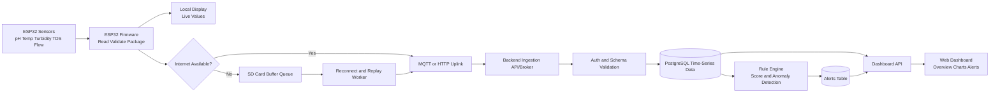
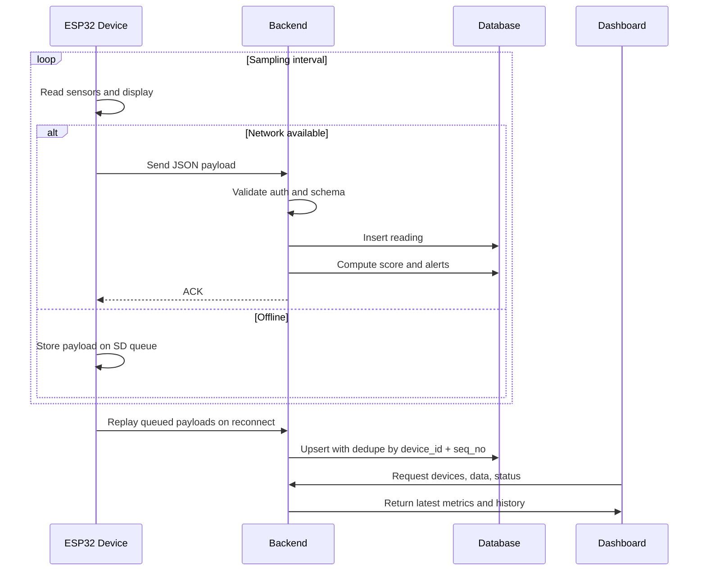

# Hydronix Data Flow Diagram

## System Data Flow

## Sequence View

## How Everything Works Together

1. Device keeps collecting readings whether online or offline.
2. Offline records are queued locally and replayed safely later.
3. Backend persists and processes data into usable intelligence.
4. Dashboard reads both raw metrics and processed alerts for operations.
