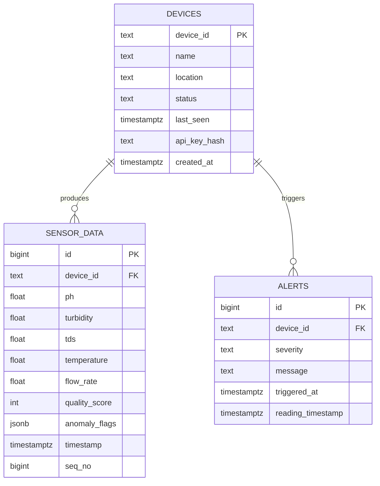

# Hydronix ER Diagram

## Notes

1. `devices.device_id` is the canonical node identity.
2. `sensor_data` has unique (`device_id`, `seq_no`) for deduplication.
3. `alerts` links to device and event timing for operator response.
