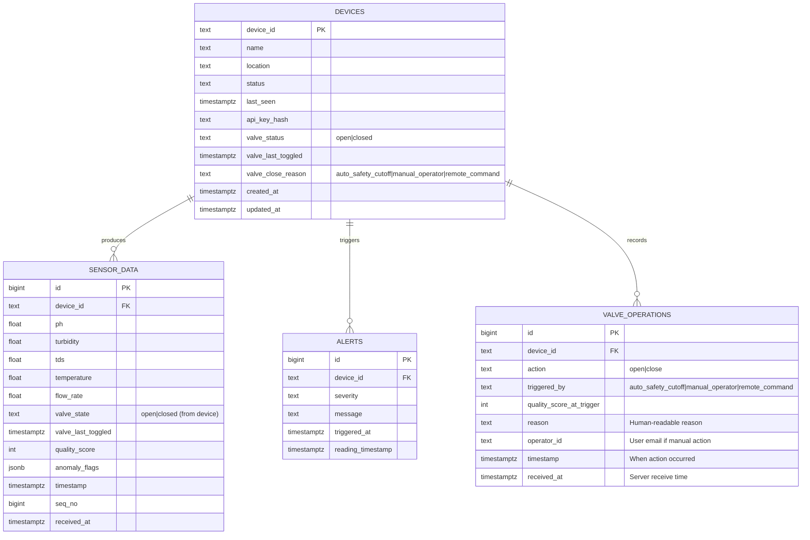

# Hydronix ER Diagram



## Notes

1. **devices.device_id** — Canonical node identity (format: HYDRO_### where ### is numeric).

2. **sensor_data** — Stores individual readings with timing info:
   - Unique (`device_id`, `seq_no`) for deduplication
   - `valve_state` and `valve_last_toggled` track device-reported valve status
   - Received via MQTT or HTTP `/ingest` endpoint

3. **valve_operations** — Audit trail for all solenoid valve state changes:
   - Logged for both auto-safety cutoffs (no operator_id) and manual operator commands (with operator_id)
   - `triggered_by` distinguishes source: auto safety threshold, operator command, or remote backend command
   - `quality_score_at_trigger` preserves water quality metrics at time of cutoff for diagnostics

4. **alerts** — Links to device and event timing for operator response; combined with valve_operations for full water quality incident timeline.

5. **Relationships:**
   - DEVICES 1:N SENSOR_DATA (one device produces many readings)
   - DEVICES 1:N ALERTS (one device can trigger many alerts)
   - DEVICES 1:N VALVE_OPERATIONS (one device can have many valve control events)

## Schema Details

### Valve State Machine

```
┌─────────────────────────────────────────────────┐
│ Solenoid Valve State (2 possible states)        │
│                                                 │
│ OPEN (default):                                 │
│   - Water flows normally                        │
│   - GPIO LOW = relay de-energized              │
│   - Safe conditions OR recovery in progress    │
│                                                 │
│ CLOSED:                                         │
│   - Water blocked                               │
│   - GPIO HIGH = relay energized                │
│   - Triggered by auto-cutoff OR manual cmd     │
│                                                 │
│ Transitions:                                    │
│   OPEN → CLOSED: If any safety threshold       │
│                  exceeded (2-sec rate limit)   │
│   CLOSED → OPEN: If all conditions safe +      │
│                  retry interval elapsed        │
│                  (2-sec rate limit)            │
└─────────────────────────────────────────────────┘
```

### Safety Thresholds (Auto-Cutoff Triggers)

| Parameter | Min | Max | Unit | Violation Action |
|-----------|-----|-----|------|-------------------|
| pH        | 6.5 | 8.5 | —    | Close valve, log reason |
| Turbidity | —   | 5.0 | NTU  | Close valve, log reason |
| TDS       | —   | 500 | ppm  | Close valve, log reason |
| Temperature | 5.0 | 50.0 | °C | Close valve, log reason |
