<![CDATA[<div align="center">

# 💧 HYDRONIX

## Smart Water Monitoring & Management Platform

### Complete Technical Documentation

**Version 2.0 — June 2026**

---

*A comprehensive 50-page technical manual covering system architecture, hardware engineering, firmware development, backend APIs, web dashboard, machine learning, and DevOps operations.*

</div>

---

<div align="center">

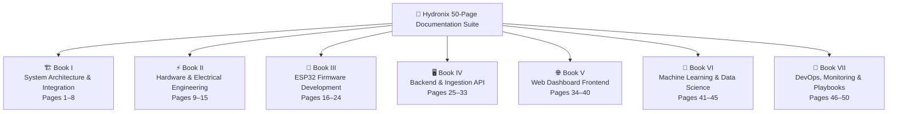

</div>

---
---

# 🏗️ BOOK I: System Architecture & Integration

**Pages 1–8**
*Focus: Overall system design, integration boundaries, database schemas, and end-to-end data security.*

---

## Page 1: Executive Summary & System Overview

### 1.1 What is Hydronix?

**Hydronix** is an end-to-end smart water monitoring and management platform that provides real-time water quality assessment, automated safety controls, and predictive analytics for residential, commercial, and municipal water systems.

**One-Line Pitch:** *Hydronix monitors water quality in real-time using IoT sensors and automatically shuts off water supply when contamination is detected — keeping people safe, 24/7.*

### 1.2 Business Value

| Capability | Value |
|---|---|
| **Real-Time Monitoring** | Continuous 5-parameter water quality measurement (pH, TDS, turbidity, temperature, flow rate) |
| **Automated Safety** | Solenoid valve auto-closes within 2 seconds when unsafe water is detected |
| **Offline Resilience** | Devices continue operating and storing data during network outages (72-hour buffer) |
| **Predictive Intelligence** | ML-powered anomaly detection identifies emerging water quality issues before they become critical |
| **Fleet Management** | Centralized dashboard for monitoring hundreds of distributed water points |

### 1.3 Core System Components

Hydronix is built on a four-layer architecture:

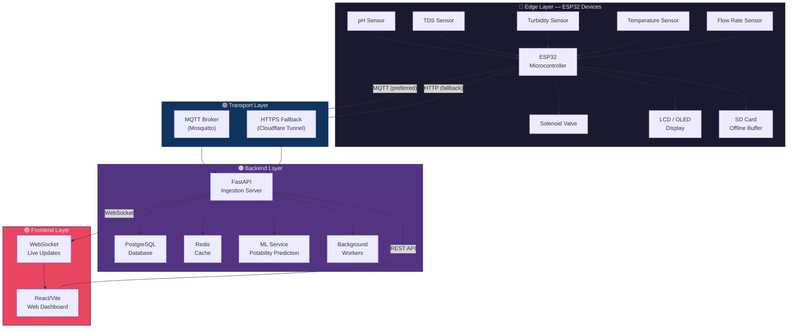

### 1.4 Physical Architecture

Each Hydronix deployment consists of:

1. **Edge Nodes** — ESP32 microcontrollers with water quality sensors, solenoid valves, and local displays, deployed at water points (taps, pipelines, tanks).
2. **Network Backbone** — WiFi connectivity from edge nodes to a central MQTT broker, with HTTP fallback when MQTT is unavailable.
3. **Central Server** — A Docker Compose stack running the FastAPI backend, PostgreSQL database, ML inference service, and React dashboard.
4. **Operator Interface** — A web-based dashboard accessible from any browser for real-time monitoring, historical analysis, and remote valve control.

---

## Page 2: System-Wide Data Flow & Protocols

### 2.1 End-to-End Data Lifecycle

Every sensor reading follows a precise path from physical measurement to dashboard visualization:

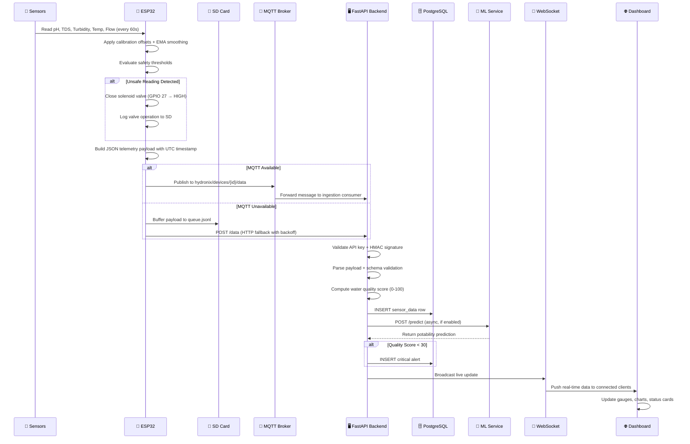

### 2.2 MQTT Protocol Configuration

| Property | Value |
|---|---|
| **Broker** | Mosquitto (Eclipse) |
| **Port** | 1883 (unencrypted, local), 8883 (TLS, production) |
| **QoS Level** | QoS 1 (at-least-once delivery) |
| **Keep-Alive** | 60 seconds |
| **Clean Session** | `false` (persistent sessions for offline device sync) |

**MQTT Topic Hierarchy:**

```
hydronix/
├── devices/
│   ├── {device_id}/
│   │   ├── data          ← Sensor telemetry (device publishes)
│   │   ├── heartbeat     ← Periodic health check (device publishes)
│   │   ├── valve/
│   │   │   ├── command   ← Remote valve control (backend publishes)
│   │   │   └── status    ← Valve state confirmation (device publishes)
│   │   └── config        ← Configuration updates (backend publishes)
│   └── broadcast/
│       └── firmware      ← OTA firmware announcements (backend publishes)
└── system/
    └── status            ← Backend health status
```

### 2.3 Telemetry Payload Schema

**Standard Sensor Reading:**
```json
{
  "device_id": "HYDRO_001",
  "ph": 7.2,
  "turbidity": 3.1,
  "tds": 120,
  "temperature": 25.0,
  "flow_rate": 10.5,
  "valve_state": "open",
  "valve_last_toggled": "2026-04-09T10:25:00Z",
  "timestamp": "2026-04-09T10:30:00Z",
  "seq_no": 9821,
  "device_reset_count": 3
}
```

**Heartbeat Payload:**
```json
{
  "device_id": "HYDRO_001",
  "heartbeat": true,
  "uptime_seconds": 86400,
  "sd_usage_percent": 45,
  "signal_strength": -65,
  "firmware_version": "1.2.3"
}
```

### 2.4 HTTP Fallback Protocol

When MQTT is unreachable, the ESP32 switches to HTTP POST with exponential backoff:

| Attempt | Delay | Notes |
|---|---|---|
| 1 | Immediate | First try |
| 2–3 | 10 seconds | Quick retry |
| 4–5 | 30 seconds | Moderate backoff |
| 6+ | 60 seconds | Polling interval (reset on success) |

The device adds `"fallback_reason": "mqtt_unreachable"` to the payload during HTTP fallback mode and attempts to return to MQTT every 10 HTTP polls (~10 minutes).

---

## Page 3: Device State Machine & Lifecycle

### 3.1 ESP32 Device States

Each Hydronix edge device operates as a finite state machine with six possible states:

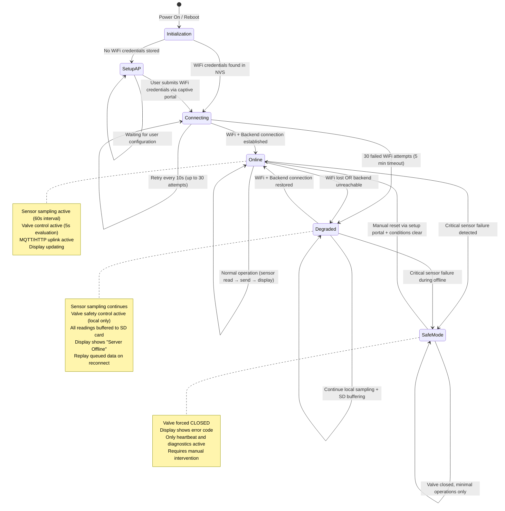

### 3.2 State Transition Triggers

| Trigger | From State | To State | Action |
|---|---|---|---|
| Power on with saved WiFi | `INIT` | `CONNECTING` | Load NVS config, attempt WiFi |
| Power on without WiFi | `INIT` | `SETUP_AP` | Start captive portal at 192.168.4.1 |
| WiFi + MQTT connected | `CONNECTING` | `ONLINE` | Begin normal sensor pipeline |
| WiFi drops | `ONLINE` | `DEGRADED` | Start SD buffering, retry WiFi |
| 30 WiFi retries fail | `CONNECTING` | `DEGRADED` | Switch to 60s retry interval |
| WiFi restored | `DEGRADED` | `ONLINE` | Replay SD queue, resume uplink |
| Sensor hardware fault | Any | `SAFE_MODE` | Close valve, alert, minimal ops |
| Manual reset | `SAFE_MODE` | `ONLINE` | Clear errors, resume full ops |

### 3.3 Degraded State — Offline Behavior

When the device enters the `DEGRADED` state:

1. **Sampling continues** — All 5 sensors are read at the configured interval
2. **Valve safety remains active** — Local threshold evaluation continues, solenoid will auto-close if unsafe water is detected
3. **SD buffering engaged** — Every reading is appended to `/data/queue.jsonl` with transaction markers
4. **Display updates** — Shows "⚠ Server Offline" with last sync time
5. **WiFi retry** — Attempts reconnection every 60 seconds
6. **On reconnect** — Replays buffered readings in FIFO order, removes from SD only after server ACK

---

## Page 4: Database ERD & Data Schema Specification

### 4.1 Entity-Relationship Diagram

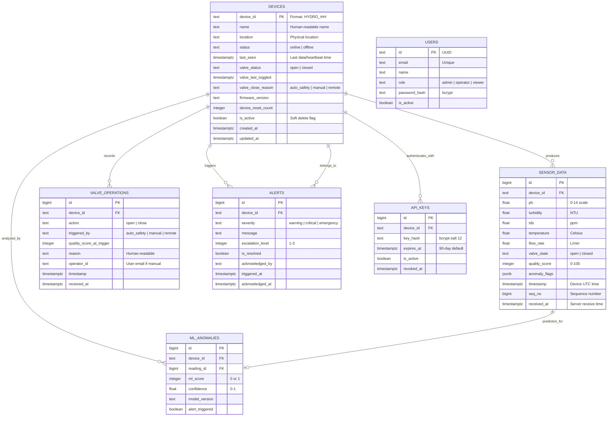

### 4.2 Indexing Strategy

| Index | Columns | Type | Purpose |
|---|---|---|---|
| `idx_sensor_device_time` | `device_id, timestamp DESC` | B-tree | Fast time-series queries per device |
| `idx_sensor_time` | `timestamp DESC` | B-tree | Global time-series pagination |
| `idx_sensor_dedup` | `device_id, device_reset_count, seq_no` | Unique | Prevent duplicate ingestion |
| `idx_alerts_device` | `device_id, triggered_at DESC` | B-tree | Alert history per device |
| `idx_alerts_escalation` | `escalation_level, acknowledged_at` | B-tree | Escalation workflow queries |
| `idx_apikeys_hash` | `key_hash` | Hash | O(1) auth lookup |

### 4.3 Data Retention Policy

| Data Type | Hot Storage | Archive | Purge |
|---|---|---|---|
| Raw sensor readings | 12 months | 3 years (Glacier) | After archive |
| Alerts | 2 years | — | After 2 years |
| Audit logs | 2 years | — | Never (compliance) |
| Device configuration | Forever (soft delete) | — | Never |
| ML predictions | 12 months | — | After 12 months |

---

## Page 5: End-to-End Authentication & Cryptographic Chain

### 5.1 Security Architecture Overview

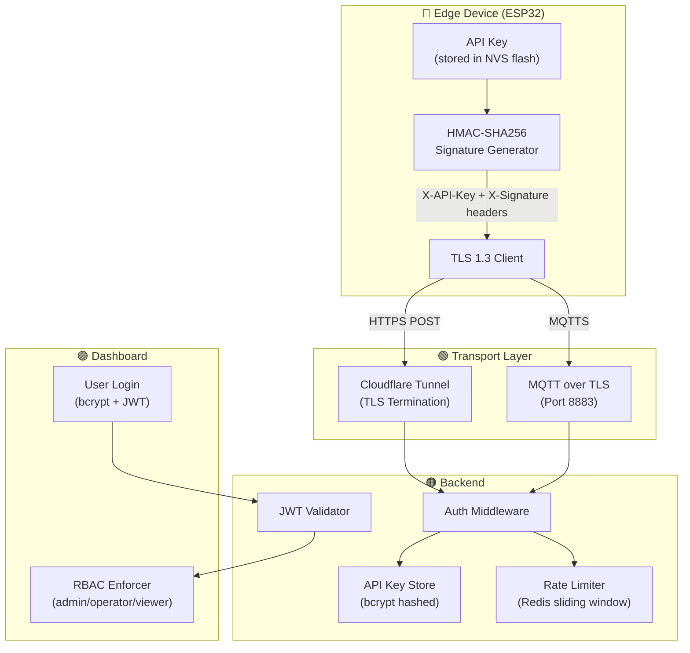

### 5.2 Device Authentication — HMAC-SHA256

Every device request is authenticated using a two-factor scheme:

1. **API Key** — Sent in the `X-API-Key` header, identifies the device
2. **HMAC Signature** — Sent in the `X-Signature` header, proves payload integrity

**Signature Generation (Device Side):**
```
signature = HMAC-SHA256(
    key = api_key,
    message = JSON.stringify(payload) + timestamp_nonce
)
```

**Verification (Server Side):**
```
1. Extract X-API-Key header
2. Look up key_hash in database (bcrypt comparison)
3. Recompute HMAC-SHA256 using stored key + request body + timestamp
4. Compare signatures (constant-time comparison to prevent timing attacks)
5. Verify timestamp nonce is within ±5 minute window (prevent replay)
```

### 5.3 API Key Lifecycle

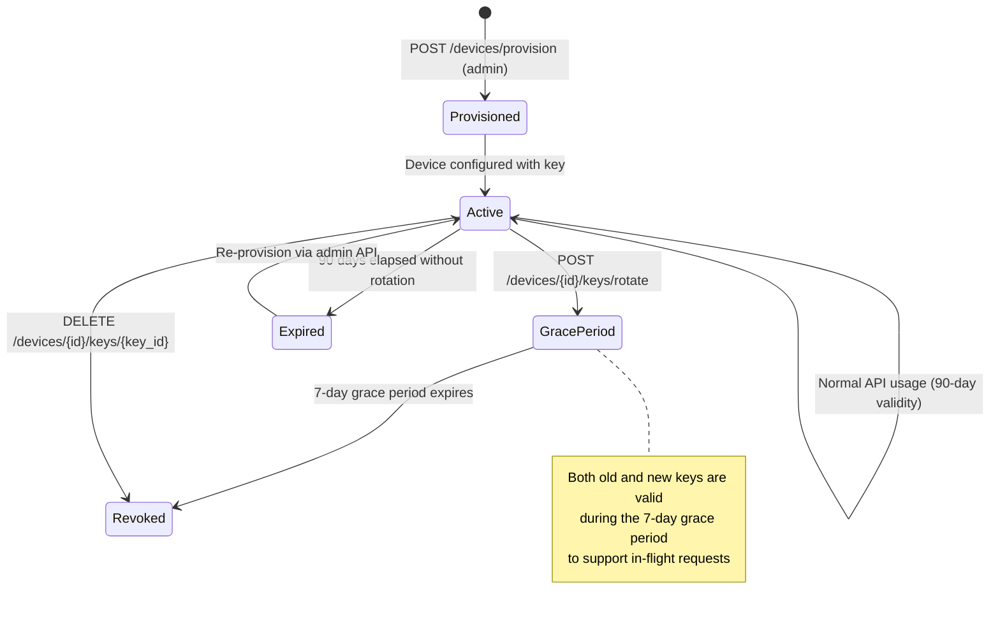

### 5.4 Transport-Layer Security

| Layer | Protocol | Configuration |
|---|---|---|
| **Device ↔ Backend (HTTP)** | TLS 1.3 | Via Cloudflare Tunnel, auto-certificate |
| **Device ↔ MQTT Broker** | TLS 1.2+ | Port 8883, username/password auth |
| **Dashboard ↔ Backend** | WSS + HTTPS | Auth token in WebSocket handshake |
| **Database** | TDE | PostgreSQL pg_tde or full-disk encryption |

### 5.5 Rate Limiting

| Scope | Limit | Window | Response |
|---|---|---|---|
| Per-device | 100 requests | 1 minute | 429 + Retry-After header |
| Per-IP | 10,000 requests | 1 hour | 429 + Retry-After header |
| Valve toggle | 1 operation | 2 seconds | Queued for next window |

---

## Page 6: System Scalability & Sharding Architecture

### 6.1 Scaling Strategy

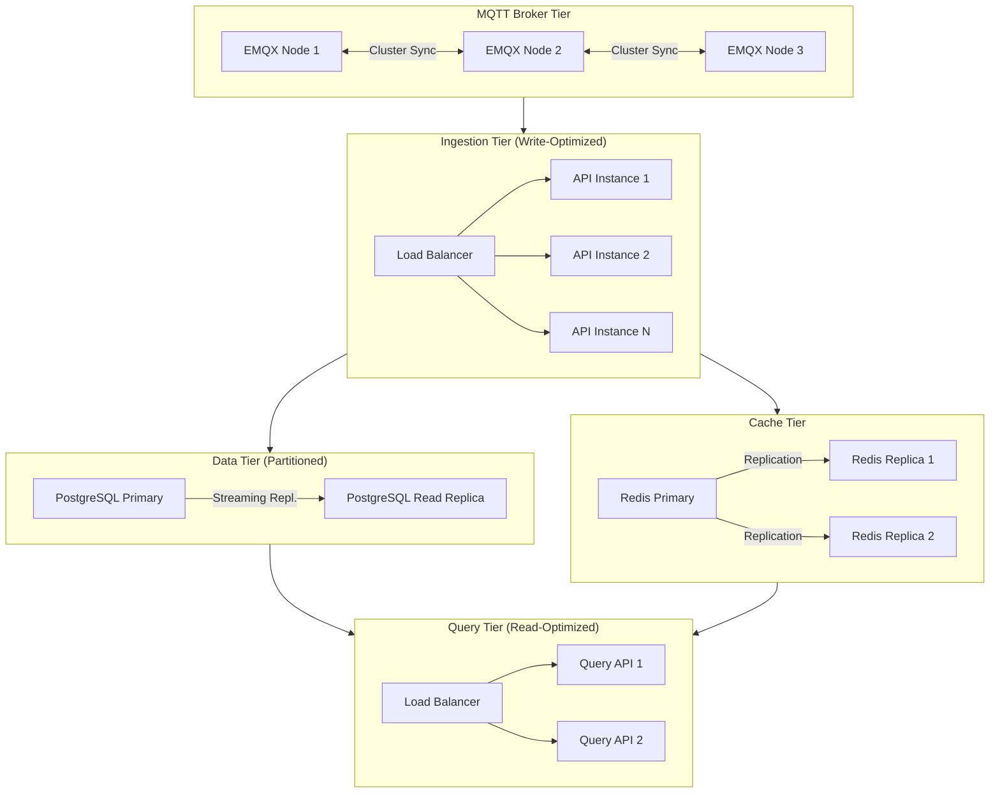

### 6.2 Database Partitioning

**Time-based partitioning** for `sensor_data` table:

```
sensor_data
├── sensor_data_2026_01  (January 2026)
├── sensor_data_2026_02  (February 2026)
├── sensor_data_2026_03  (March 2026)
└── ...
```

**Partition key:** `(device_id, timestamp)` — enables both per-device queries and global time-range scans.

### 6.3 Redis Caching Strategy

| Cache Key | TTL | Purpose |
|---|---|---|
| `device:{id}:status` | 120s | Current online/offline status |
| `device:{id}:latest` | 60s | Most recent sensor reading |
| `device:{id}:valve` | 30s | Current valve state |
| `rate:{device_id}:{minute}` | 60s | Rate limit counter |
| `rate:{ip}:{hour}` | 3600s | IP-based rate limit |

### 6.4 Scaling Targets

| Metric | Phase 1 | Phase 2 | Phase 3 |
|---|---|---|---|
| Concurrent devices | 50 | 1,000 | 10,000+ |
| Readings/second | ~1 | ~17 | ~167 |
| Database size/month | ~50 MB | ~1 GB | ~10 GB |
| API latency (p99) | <500ms | <200ms | <100ms |

---

## Page 7: Disaster Recovery & Offline Resiliency Protocol

### 7.1 Offline Buffer Architecture

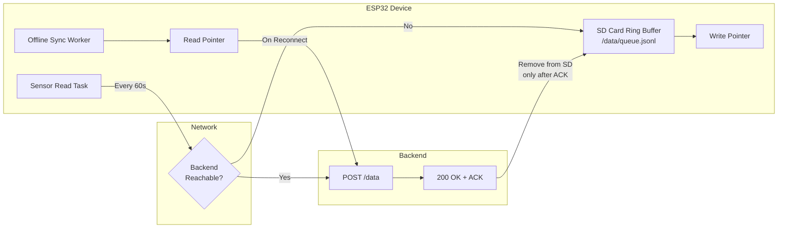

### 7.2 SD Card Ring Buffer Rules

| Parameter | Value |
|---|---|
| **Maximum capacity** | 4,320 records (72 hours at 60s intervals) |
| **Storage format** | JSON Lines (`queue.jsonl`) with transaction markers |
| **Eviction policy** | FIFO — oldest records garbage-collected at 95% capacity |
| **Integrity check** | CRC checksum per record, skip corrupted entries on recovery |
| **Replay order** | Oldest-first (preserve chronological ordering) |
| **Deletion policy** | Records removed only after server HTTP 200 or MQTT ACK |

**Transaction Marker Format:**
```
[START]
{"device_id":"HYDRO_001","ph":7.2,...,"seq_no":9821}
{checksum: "a3f2b1c4"}
[END]
```

### 7.3 Sync Replay Protocol

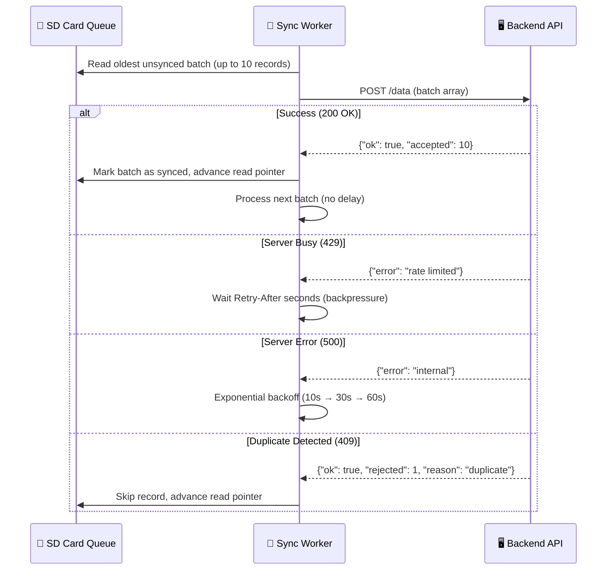

### 7.4 Failure Scenarios & Recovery

| Scenario | Device Behavior | Backend Behavior | Dashboard Display |
|---|---|---|---|
| **Network down** | Buffers to SD, valve safety active | Marks device offline after 120s | "Offline" badge, last known state |
| **Valve GPIO fails** | Log error, retry 3x, alert backend | Detect stuck state, escalate | "Valve Malfunction" alert |
| **Power loss** | Valve defaults OPEN (fail-safe) | N/A | "Device Powered Off" |
| **SD card full** | Flush to backend, FIFO eviction | Accept burst traffic | "Low Storage" warning |
| **Split-brain conflict** | Local safety close wins | Log both operations, merge audit | Show full timeline |

---

## Page 8: Hardware-Firmware-Software Interaction Matrices

### 8.1 Sensor-to-Backend Variable Mapping

| Hardware Register | ESP32 GPIO | Firmware Variable | Backend Field | Unit | Valid Range |
|---|---|---|---|---|---|
| pH Sensor (analog) | GPIO 32 (ADC1) | `sensor_ph` | `ph` | pH | 0 – 14 |
| Turbidity (analog) | GPIO 33 (ADC1) | `sensor_turbidity` | `turbidity` | NTU | 0 – 1000 |
| TDS Sensor (analog) | GPIO 34 (ADC1) | `sensor_tds` | `tds` | ppm | 0 – 10,000 |
| Temperature (digital) | GPIO 35 (1-Wire) | `sensor_temperature` | `temperature` | °C | -50 – 150 |
| Flow Rate (interrupt) | GPIO 36 (VP) | `sensor_flow_rate` | `flow_rate` | L/min | 0 – 10,000 |
| Solenoid Valve | GPIO 27 (output) | `valve_state` | `valve_status` | — | open / closed |

### 8.2 Timing Budget & SLAs

```mermaid
gantt
    title Hydronix Timing Budget — One Sensor Cycle (60 seconds)
    dateFormat X
    axisFormat %s

    section Sensor Read
    Read all 5 sensors           :s1, 0, 2
    Apply calibration + smoothing :s2, 2, 3
    
    section Valve Control
    Evaluate safety thresholds   :v1, 3, 4
    Execute valve toggle (if needed) :v2, 4, 5
    
    section Data Processing
    Build JSON payload           :d1, 5, 6
    
    section Uplink
    Send MQTT/HTTP               :u1, 6, 8
    Wait for ACK                 :u2, 8, 9
    
    section Display
    Update LCD/OLED              :l1, 9, 10
    
    section Idle
    Sleep until next cycle       :i1, 10, 60
```

### 8.3 Performance SLAs

| Operation | Target | Maximum |
|---|---|---|
| Sensor read cycle (all 5) | < 500ms | 2,000ms |
| Valve shutoff (threshold breach to physical closure) | < 1s | 2s |
| MQTT publish + ACK | < 200ms | 1,000ms |
| HTTP POST + response | < 500ms | 2,000ms |
| Display update | < 100ms | 500ms |
| SD card write (single record) | < 50ms | 200ms |
| Backend ingestion (API to DB write) | < 100ms | 500ms |
| Dashboard live update (sensor read to UI) | < 2s | 5s |

### 8.4 Error Tolerance Margins

| Parameter | Sensor Accuracy | Acceptable Drift | Calibration Interval |
|---|---|---|---|
| pH | ±0.1 pH | ±0.5 pH over 30 days | Every 30 days |
| Turbidity | ±1 NTU | ±2 NTU over 30 days | Every 30 days |
| TDS | ±10 ppm | ±20 ppm over 30 days | Every 30 days |
| Temperature | ±0.5°C | ±1°C over 6 months | Every 6 months |
| Flow Rate | ±5% | ±10% over 12 months | Every 12 months |

---
---

# ⚡ BOOK II: Hardware Design & Assembly

**Pages 9–15**
*Focus: Circuit designs, sensor specs, wiring, power, and physical enclosure guidelines.*

---

## Page 9: Microcontroller Selection & Pin Allocation Map

### 9.1 ESP32 DevKitC Specifications

| Specification | Value |
|---|---|
| **Module** | ESP32-WROOM-32 (C Type, 38 Pins, CP2102) |
| **CPU** | Dual-core Xtensa LX6, 240 MHz |
| **RAM** | 520 KB SRAM |
| **Flash** | 4 MB |
| **WiFi** | 802.11 b/g/n, 2.4 GHz |
| **Bluetooth** | BLE 4.2 (unused) |
| **ADC** | 12-bit, 18 channels (ADC1: GPIO 32-39) |
| **GPIO** | 38 pins total, 34 programmable |
| **Operating Voltage** | 3.3V logic, 5V input via USB-C |

### 9.2 Complete GPIO Allocation Table

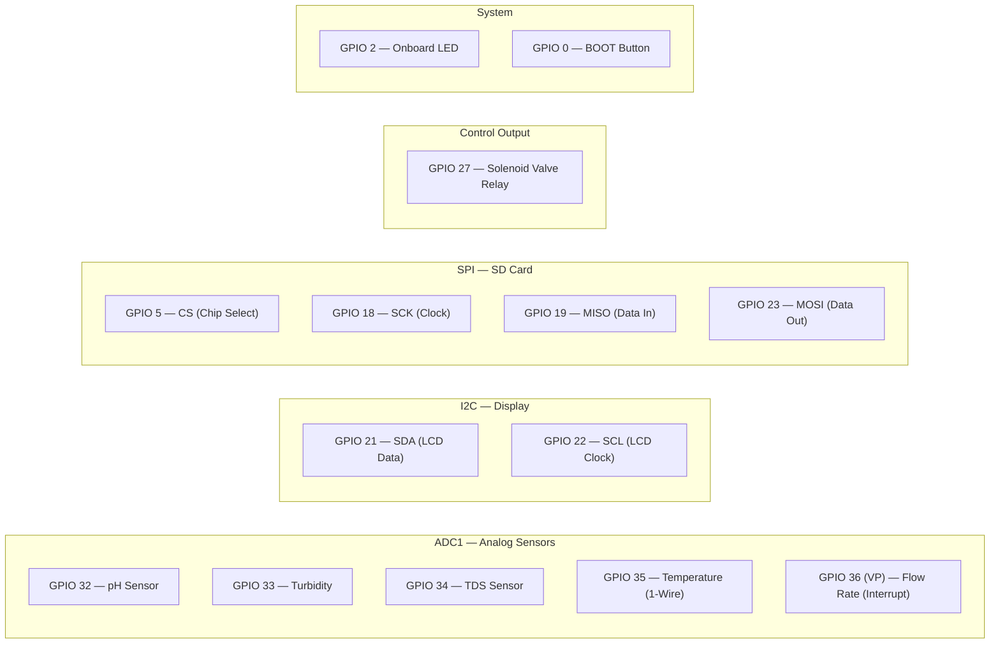

### 9.3 38-Pin ESP32 Pinout Map

```
                     ┌────────────────────────────────┐
                     │       ESP32 NODEMCU-32S        │
                     │            (38 Pin)            │
                     │         USB-C Connector        │
                     ├────────────────────────────────┤
            3V3  ── │ 1                            38 │ ── GND
             EN  ── │ 2                            37 │ ── P23 (GPIO 23 / SD MOSI)
  FLOW →    SUP  ── │ 3                            36 │ ── P22 (GPIO 22 / LCD SCL)
            SUN  ── │ 4                            35 │ ── TX  (GPIO 1  / TX0)
   TDS →    P34  ── │ 5                            34 │ ── RX  (GPIO 3  / RX0)
  TEMP →    P35  ── │ 6                            33 │ ── GND
    pH →    P32  ── │ 7                            32 │ ── P21 (GPIO 21 / LCD SDA)
  TURB →    P33  ── │ 8                            31 │ ── P19 (GPIO 19 / SD MISO)
            P25  ── │ 9                            30 │ ── P18 (GPIO 18 / SD SCK)
            P26  ── │ 10                           29 │ ── P5  (GPIO 5  / SD CS)
 VALVE ←    P27  ── │ 11                           28 │ ── P17 (GPIO 17 / TX2)
            P14  ── │ 12                           27 │ ── P16 (GPIO 16 / RX2)
            P12  ── │ 13                           26 │ ── P4  (GPIO 4)
            GND  ── │ 14                           25 │ ── P0  (GPIO 0  / BOOT)
            P13  ── │ 15                           24 │ ── P2  (GPIO 2  / LED)
            SD2  ── │ 16                           23 │ ── P15 (GPIO 15)
            SD3  ── │ 17                           22 │ ── SD1 (GPIO 8)
            GND  ── │ 18                           21 │ ── SD0 (GPIO 7)
             5V  ── │ 19                           20 │ ── CLK (GPIO 6)
                     └────────────────────────────────┘
```

### 9.4 Strapping Pin Safety

> ⚠️ **Critical:** The following pins have special boot functions. Do NOT connect them to strong pull-up or pull-down circuits:

| Pin | Boot Function | Safe Usage |
|---|---|---|
| GPIO 0 | Boot mode select (LOW=download, HIGH=run) | Use with pull-up, no external load |
| GPIO 2 | Must be LOW for serial flashing | Onboard LED only |
| GPIO 5 | Controls timing of SDIO slave | OK for SD CS (has internal pull-up) |
| GPIO 12 | Selects flash voltage (LOW=3.3V) | Avoid external pull-up to 5V |
| GPIO 15 | Debug UART silencing | OK with pull-up |

---

## Page 10: pH & Temperature Sensor Integration Guide

### 10.1 pH Sensor Module

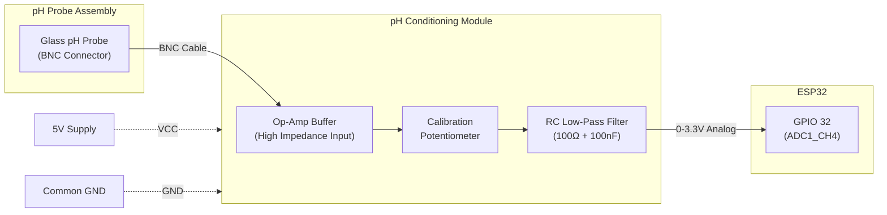

**Calibration Formula:**
```
Voltage = ADC_raw × (3.3 / 4095)
pH = 3.5 × Voltage + calibration_offset
```

Where `calibration_offset` is determined by immersing the probe in pH 7.0 buffer solution and computing the deviation from expected voltage.

**Calibration Procedure:**
1. Immerse probe in pH 7.0 buffer solution
2. Read sensor for 30 seconds, compute median
3. Store offset: `offset = 7.0 - computed_pH`
4. Verify with pH 4.0 buffer (optional two-point calibration)

### 10.2 DS18B20 Temperature Sensor

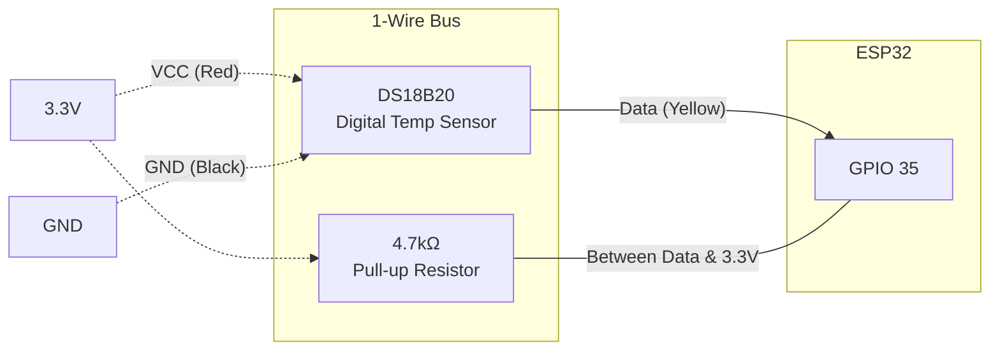

| Specification | Value |
|---|---|
| Protocol | Dallas 1-Wire |
| Resolution | 12-bit (0.0625°C) |
| Range | -55°C to +125°C |
| Accuracy | ±0.5°C (-10 to +85°C) |
| Pull-up | 4.7kΩ between Data and 3.3V |
| Conversion time | 750ms (12-bit mode) |

### 10.3 ADC Noise Reduction

To minimize noise on analog pH readings:

1. **Hardware RC filter:** 100Ω resistor + 100nF capacitor at ADC input pin
2. **Software median filter:** Take 11 samples, sort, use median value
3. **EMA smoothing:** `smoothed = current × 0.3 + previous × 0.7`
4. **Separate analog supply rail** from digital circuitry to prevent switching noise

---

## Page 11: TDS & Turbidity Sensor Integration Guide

### 11.1 TDS Sensor Module

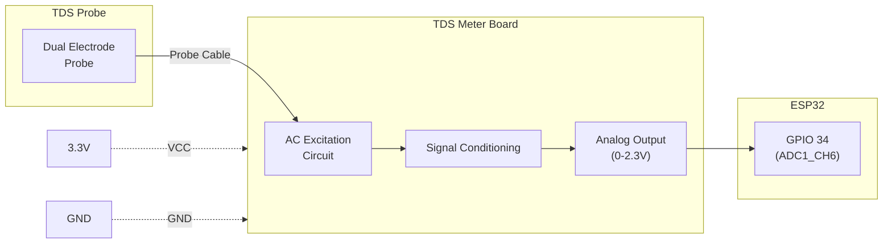

**TDS Conversion Formula:**
```
Voltage = ADC_raw × (3.3 / 4095)
compensationCoefficient = 1.0 + 0.02 × (temperature - 25.0)
compensationVoltage = Voltage / compensationCoefficient
TDS (ppm) = (133.42 × compensationVoltage³ 
           - 255.86 × compensationVoltage² 
           + 857.39 × compensationVoltage) × 0.5
```

> ⚠️ **Important:** TDS probes use AC excitation to prevent electrode polarization. The TDS meter board handles this internally — never apply DC voltage directly to the probe.

### 11.2 Turbidity Sensor Module

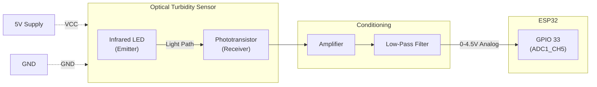

**Turbidity Conversion (non-linear):**

| Voltage (V) | Turbidity (NTU) |
|---|---|
| 4.2+ | 0 (clear) |
| 3.0 | ~500 |
| 2.5 | ~1000 |
| < 2.0 | ~3000+ (opaque) |

### 11.3 Voltage Isolation

To prevent sensor crosstalk between analog sensors:

- **pH sensor** powered from 5V rail
- **TDS sensor** powered from 3.3V rail
- **Turbidity sensor** powered from 5V rail
- Each sensor has its own decoupling capacitor (0.1µF ceramic at VCC pin)
- ADC inputs protected with series 100Ω + 100nF RC filter

---

## Page 12: Flow Rate Sensor & Solenoid Valve Control

### 12.1 YF-S201 / HW21WA Hall-Effect Flow Sensor

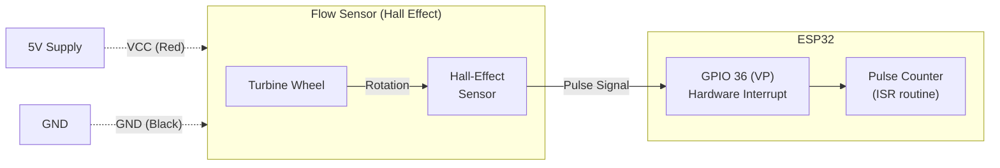

**Flow Rate Calculation:**
```
Q (L/min) = Pulse_Frequency (Hz) / 7.5
```

Where `Pulse_Frequency` is measured by counting pulses over a 1-second window using hardware interrupts.

| Specification | Value |
|---|---|
| Working Voltage | 5V DC |
| Flow Range | 1–30 L/min |
| Pulse Output | ~7.5 pulses per liter |
| Interface | GPIO interrupt (rising edge) |

### 12.2 Solenoid Valve Control Circuit

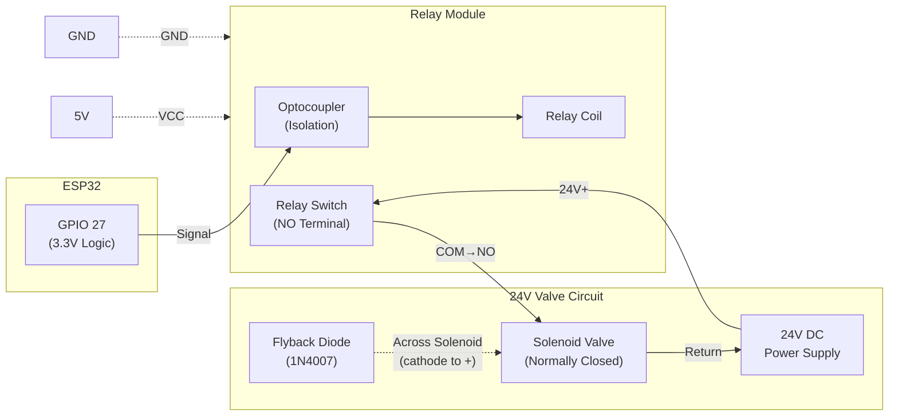

**Valve Logic (Normally-Closed Design):**

| GPIO 27 State | Relay | Solenoid | Water Flow |
|---|---|---|---|
| LOW (default) | De-energized | De-energized / Closed | **BLOCKED** |
| HIGH | Energized | Energized / Open | **FLOWING** |
| Power loss | De-energized | De-energized / Closed | **BLOCKED** (fail-safe) |

> ⚠️ **Safety:** The flyback diode (1N4007) across the solenoid coil is **mandatory** to suppress voltage spikes when the relay switches off. Without it, the ESP32 may reset or sustain damage.

---

## Page 13: Local Display & Storage Modules

### 13.1 I2C LCD Display (20×4)

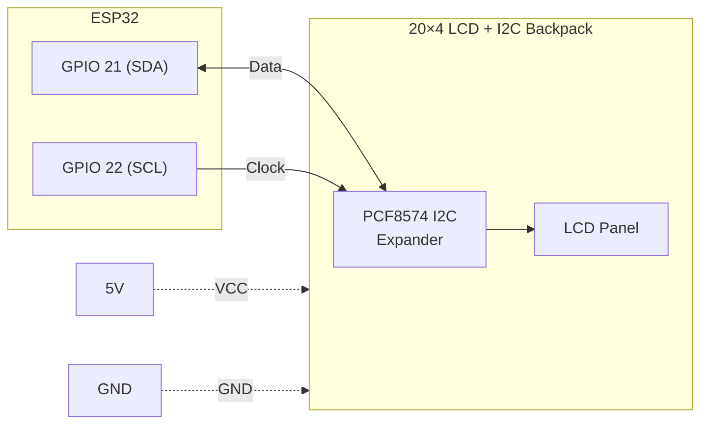

**Display Layout:**
```
┌────────────────────────────────────────┐
│ Line 1: Device: HYDRO_001 | pH: 7.2   │
│ Line 2: Turb: 3.1 NTU | Temp: 25°C   │
│ Line 3: Status: Online | Sig: -65dBm  │
│ Line 4: Queue: 0 | SD: 45% | Sync: 30s│
└────────────────────────────────────────┘
```

**Alert State Display:**
```
┌────────────────────────────────────────┐
│ Line 1: ⚠️  ALERT: VALVE CLOSED        │
│ Line 2: Reason: pH too low (6.2)       │
│ Line 3: Action: Wait for safe cond.    │
│ Line 4: Quality: 15/100 | Reopen: Auto │
└────────────────────────────────────────┘
```

### 13.2 SPI SD Card Module

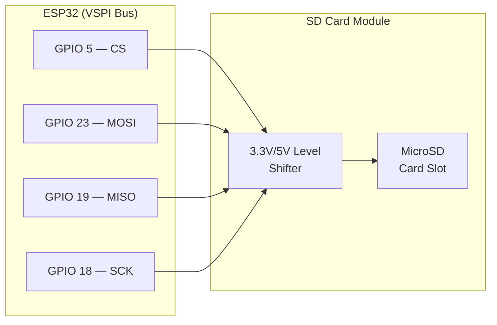

**Bypass Capacitor Placement:**
- **0.1µF ceramic** capacitor directly at the SD module's VCC pin (high-frequency noise)
- **10µF electrolytic** capacitor on the 5V rail near the SD module (bulk energy for write surges)

> ⚠️ Without bypass capacitors, the SD card's current surges during writes can cause the ESP32 to brown-out and reset.

---

## Page 14: Power Delivery & Battery Backup Circuitry

### 14.1 Power Distribution

```mermaid
flowchart TB
    subgraph INPUT ["Power Input"]
        AC["AC Mains<br/>220V"]
        BAT["Li-ion 18650<br/>3.7V Cells (3S)"]
    end

    subgraph CONVERSION ["Power Conversion"]
        ACDC["AC-DC Adapter<br/>12V / 3A"]
        BOOST["XL6019 Boost Module<br/>12V → 24V"]
        REG5["LM7805 / AMS1117<br/>12V → 5V"]
        TP4056["TP4056 Charge<br/>Controller"]
    end

    subgraph RAILS ["Power Rails"]
        R24["24V Rail"]
        R5["5V Rail"]
        R33["3.3V Rail<br/>(ESP32 onboard)"]
    end

    subgraph LOADS ["Loads"]
        SOLENOID["Solenoid Valve<br/>(24V, 500mA)"]
        SENSORS["pH, Turbidity,<br/>Flow, LCD, Relay<br/>(5V, ~200mA)"]
        MCU_S["ESP32 + TDS +<br/>Temperature<br/>(3.3V, ~250mA)"]
    end

    AC --> ACDC
    ACDC --> BOOST
    ACDC --> REG5
    ACDC --> TP4056
    BAT <-->|"Charge/Discharge"| TP4056

    BOOST --> R24
    REG5 --> R5
    R5 -->|"ESP32 onboard regulator"| R33

    R24 --> SOLENOID
    R5 --> SENSORS
    R33 --> MCU_S
```

### 14.2 Power Budget

| Component | Voltage | Current (Typical) | Current (Peak) |
|---|---|---|---|
| ESP32 (WiFi active) | 3.3V | 80mA | 250mA |
| pH Sensor Module | 5V | 10mA | 15mA |
| Turbidity Sensor | 5V | 30mA | 40mA |
| TDS Sensor | 3.3V | 5mA | 10mA |
| Temperature (DS18B20) | 3.3V | 1mA | 1.5mA |
| Flow Rate Sensor | 5V | 15mA | 20mA |
| I2C LCD Display | 5V | 40mA | 80mA (backlight) |
| Relay Module | 5V | 70mA | 90mA |
| SD Card Module | 3.3V/5V | 30mA | 100mA (write) |
| Solenoid Valve | 24V | 0mA (closed) | 500mA (open) |
| **Total (excl. solenoid)** | — | **~281mA** | **~606mA** |

### 14.3 Battery Backup & UVLO

- **Battery:** 3S Li-ion 18650 pack (11.1V nominal)
- **Charge Controller:** TP4056 per cell with DW01 protection
- **Boost Module:** XL6019 step-up from battery voltage to 24V for solenoid
- **UVLO (Under-Voltage Lockout):** Cut off battery at 3.0V/cell (9.0V total) to prevent deep discharge
- **Power Fail Detection:** GPIO interrupt on voltage divider monitors input power, triggers "battery mode" state

---

## Page 15: PCB Layout, Enclosure Design, & Environmental Protection

### 15.1 PCB Layout Guidelines

| Guideline | Specification |
|---|---|
| **Solenoid power traces** | Minimum 1.5mm width (500mA @ 24V) |
| **Ground plane** | Solid copper pour on bottom layer |
| **Analog/Digital separation** | Split ground plane under ADC inputs, reunite at single point |
| **Decoupling caps** | 0.1µF within 5mm of every IC VCC pin |
| **Antenna keep-out** | No copper pour within 15mm of ESP32 antenna |

### 15.2 Enclosure Specifications

```mermaid
flowchart TB
    subgraph ENCLOSURE ["IP67 NEMA-4X Enclosure"]
        subgraph INTERNAL ["Internal Layout"]
            PCB_ZONE["PCB Mount<br/>(DIN rail or standoffs)"]
            BAT_ZONE["Battery<br/>Compartment"]
            CONN_ZONE["Connector<br/>Terminal Block"]
        end
        
        subgraph EXTERNAL ["External Interfaces"]
            PG7_1["PG7 Gland<br/>(Sensor cables)"]
            PG7_2["PG7 Gland<br/>(Power input)"]
            PG9["PG9 Gland<br/>(Solenoid cable)"]
            USB_PORT["USB-C Port<br/>(sealed cap)"]
            LCD_WIN["Display Window<br/>(polycarbonate)"]
        end
    end

    PG7_1 --> CONN_ZONE
    PG7_2 --> CONN_ZONE
    PG9 --> CONN_ZONE
    CONN_ZONE --> PCB_ZONE
```

### 15.3 Environmental Protection

| Protection | Method |
|---|---|
| **Water ingress (IP67)** | Silicone gasket seal, PG waterproof cable glands |
| **UV resistance** | ABS/polycarbonate enclosure (UV-stabilized) |
| **Thermal management** | Passive heat dissipation via aluminum standoffs for voltage regulator |
| **Anti-condensation** | Breather vent with Gore-Tex membrane, silica gel packet |
| **Vibration** | PCB secured with M3 brass standoffs, conformal coating on solder joints |

---
---

# 🔧 BOOK III: ESP32 Firmware Development Manual

**Pages 16–24**
*Focus: PlatformIO setup, Wi-Fi captive portal, FreeRTOS tasks, local queue storage, and MQTT sync workflows.*

---

## Page 16: Firmware Project Structure & PlatformIO Configuration

### 16.1 Project Directory Layout

```
firmware/
├── platformio.ini          ← Build configuration
├── src/
│   └── firmware.ino        ← Main entry point (setup + loop)
├── lib/
│   ├── ApiClient/
│   │   ├── ApiClient.cpp   ← MQTT + HTTP transport client
│   │   └── ApiClient.h
│   ├── SensorReader/
│   │   ├── SensorReader.cpp ← Multi-sensor acquisition
│   │   └── SensorReader.h
│   ├── WiFiManager/
│   │   ├── WiFiManager.cpp  ← Captive portal + WiFi management
│   │   └── WiFiManager.h
│   └── ValveControl/
│       ├── valve_control.cpp ← Solenoid valve logic
│       └── valve_control.h
├── include/
│   └── Config.h             ← Device configuration constants
├── data/                     ← SPIFFS/LittleFS web portal files
│   ├── index.html
│   └── style.css
└── test/
```

### 16.2 PlatformIO Configuration

```ini
[env:esp32dev]
platform = espressif32
board = esp32dev
framework = arduino
monitor_speed = 115200
lib_deps =
    knolleary/PubSubClient@^2.8
    bblanchon/ArduinoJson@^6.21
    paulstoffregen/OneWire@^2.3.7
    milesburton/DallasTemperature@^3.11
    olikraus/U8g2@^2.35
build_flags =
    -DCORE_DEBUG_LEVEL=1        ; Production: minimal debug
    -DBOARD_HAS_PSRAM=0
    -DMQTT_MAX_PACKET_SIZE=1024
board_build.partitions = min_spiffs.csv
```

### 16.3 FreeRTOS Task Architecture

```mermaid
flowchart TB
    subgraph TASKS ["FreeRTOS Tasks (Running on Dual Cores)"]
        T1["task_sensor_read<br/>Core 1 | Priority 5<br/>Every 60s"]
        T2["task_valve_control<br/>Core 1 | Priority 6<br/>Every 5s"]
        T3["task_display_update<br/>Core 0 | Priority 3<br/>Every 2s"]
        T4["task_network_manager<br/>Core 0 | Priority 4<br/>Continuous"]
        T5["task_uplink_sender<br/>Core 0 | Priority 4<br/>On new data"]
        T6["task_offline_sync<br/>Core 0 | Priority 2<br/>On reconnect"]
        T7["task_health_heartbeat<br/>Core 0 | Priority 1<br/>Every 30 min"]
    end

    subgraph SHARED ["Shared Resources (Mutex Protected)"]
        READINGS["Latest Sensor<br/>Readings Struct"]
        VALVE_STATE["Valve State<br/>& History"]
        QUEUE["SD Queue<br/>File Handle"]
    end

    T1 -->|"Write"| READINGS
    T2 -->|"Read"| READINGS
    T2 -->|"Write"| VALVE_STATE
    T3 -->|"Read"| READINGS
    T3 -->|"Read"| VALVE_STATE
    T5 -->|"Read"| READINGS
    T5 -->|"R/W"| QUEUE
    T6 -->|"R/W"| QUEUE
```

---

## Page 17: WiFi Manager & Local Configuration Captive Portal

### 17.1 Captive Portal Flow

```mermaid
stateDiagram-v2
    [*] --> CheckNVS: Device boots

    CheckNVS --> StartAP: No WiFi credentials in NVS
    CheckNVS --> ConnectWiFi: Credentials found

    StartAP --> Portal: AP "Hydronix_Setup_{DEVICE_ID}" started
    Portal --> Portal: User connects to AP (192.168.4.1)
    Portal --> SaveConfig: User submits WiFi + Server config
    SaveConfig --> ConnectWiFi: Credentials saved to NVS

    ConnectWiFi --> Online: Connection successful
    ConnectWiFi --> RetryWiFi: Connection failed
    RetryWiFi --> ConnectWiFi: Retry every 10s (30 attempts)
    RetryWiFi --> StartAP: All retries exhausted
```

### 17.2 Setup Portal Pages

The captive portal serves an embedded HTML/CSS interface at `192.168.4.1`:

**Configuration Screens:**

| Screen | Fields | Validation |
|---|---|---|
| **WiFi Config** | SSID (dropdown + manual), Password, Test Connection | Signal strength display |
| **Server Config** | Hostname/IP, Port, Protocol (MQTT/HTTP) | Connectivity test |
| **Device Config** | Device ID (`HYDRO_###`), API Key (paste or generate) | Format validation |
| **Calibration** | "Run Calibration" button, pH buffer value input | 30-second median sampling |
| **Status** | Signal dBm, Server ping, SD usage, Firmware version, Uptime | Read-only |
| **Maintenance** | Factory Reset (with confirmation), OTA Update, Reboot | Warning dialogs |

### 17.3 NVS Storage Schema

All configuration is persisted in ESP32 Non-Volatile Storage (NVS) with CRC checksums:

| NVS Key | Type | Example Value |
|---|---|---|
| `device_id` | String | `HYDRO_001` |
| `wifi_ssid` | String | `Office_Network` |
| `wifi_pass` | String | `(encrypted)` |
| `server_host` | String | `api.hydronix.local` |
| `server_port` | Int | `1883` |
| `protocol` | String | `mqtt` |
| `api_key` | String | `hydro_1a2b3c4d...` |
| `sample_interval` | Int | `60` |
| `reset_count` | Int | `3` |
| `cal_ph_offset` | Float | `0.2` |
| `cal_date` | Int64 | `1719446400` (Unix timestamp) |

---

## Page 18: Non-Blocking Sensor Ingestion & Driver Implementation

### 18.1 Sensor Read Pipeline

```mermaid
flowchart TB
    START["task_sensor_read<br/>(every 60 seconds)"] --> READ["Read Raw ADC Values"]
    READ --> MEDIAN["Apply Median Filter<br/>(11 samples, use middle)"]
    MEDIAN --> CALIBRATE["Apply Calibration Offsets<br/>(from NVS storage)"]
    CALIBRATE --> SMOOTH["Apply EMA Smoothing<br/>smoothed = curr×0.3 + prev×0.7"]
    SMOOTH --> SANITY{"Sanity Check<br/>Within bounds?"}
    
    SANITY -->|"Pass"| BUILD["Build JSON Payload<br/>with UTC Timestamp"]
    SANITY -->|"Fail"| SKIP["Skip Reading<br/>Log error to SD"]

    BUILD --> DISPLAY["Update Shared<br/>Readings Struct"]
    DISPLAY --> NOTIFY["Notify uplink_sender<br/>(FreeRTOS semaphore)"]
```

### 18.2 Analog-to-Physical Conversion

| Sensor | Raw Input | Conversion Formula | Output Unit |
|---|---|---|---|
| **pH** | 0–4095 ADC | `pH = 3.5 × (ADC × 3.3/4095) + offset` | pH (0–14) |
| **TDS** | 0–4095 ADC | Cubic polynomial with temp compensation | ppm |
| **Turbidity** | 0–4095 ADC | Non-linear lookup table | NTU |
| **Temperature** | 1-Wire digital | `DallasTemperature::getTempCByIndex(0)` | °C |
| **Flow Rate** | Pulse count/sec | `Q = frequency / 7.5` | L/min |

### 18.3 Sanity Bounds

| Parameter | Minimum | Maximum | Action on Violation |
|---|---|---|---|
| pH | 0 | 14 | Skip reading, log error |
| Turbidity | 0 | 1,000 NTU | Skip reading, log error |
| TDS | 0 | 10,000 ppm | Skip reading, log error |
| Temperature | -50°C | 150°C | Skip reading, log error |
| Flow Rate | 0 | 10,000 L/min | Skip reading, log error |

### 18.4 Sensor Failure Detection

| Condition | Detection | Action |
|---|---|---|
| **Stuck sensor** | No value change for 24 hours | Flag in anomaly_flags, display warning |
| **Out-of-range** | Value beyond sanity bounds | Skip reading, log error |
| **Rate-of-change spike** | Change > 2 units per minute | Apply heavy smoothing, flag reading |
| **Hardware disconnect** | ADC reads 0 or 4095 consistently | Enter SAFE_MODE, alert |

---

## Page 19: Valve Control Logic & Offline Threshold Assessment

### 19.1 Safety Threshold Evaluation

```mermaid
flowchart TB
    START["task_valve_control<br/>(every 5 seconds)"] --> READ_DATA["Read Latest<br/>Sensor Values"]
    READ_DATA --> CHECK_PH{"pH in<br/>6.5 – 8.5?"}
    
    CHECK_PH -->|"No"| UNSAFE["❌ UNSAFE"]
    CHECK_PH -->|"Yes"| CHECK_TURB{"Turbidity<br/>≤ 5.0 NTU?"}
    
    CHECK_TURB -->|"No"| UNSAFE
    CHECK_TURB -->|"Yes"| CHECK_TDS{"TDS<br/>≤ 500 ppm?"}
    
    CHECK_TDS -->|"No"| UNSAFE
    CHECK_TDS -->|"Yes"| CHECK_TEMP{"Temperature<br/>5 – 50°C?"}
    
    CHECK_TEMP -->|"No"| UNSAFE
    CHECK_TEMP -->|"Yes"| SAFE["✅ SAFE"]
    
    SAFE --> IS_CLOSED{"Valve currently<br/>closed?"}
    IS_CLOSED -->|"Yes"| RATE{"Rate limit<br/>elapsed (2s)?"}
    IS_CLOSED -->|"No"| CONTINUE["Continue<br/>Normal Operation"]
    RATE -->|"Yes"| OPEN_VALVE["Open Valve<br/>GPIO 27 → HIGH"]
    RATE -->|"No"| WAIT["Wait for<br/>rate limit"]
    
    UNSAFE --> IS_OPEN{"Valve currently<br/>open?"}
    IS_OPEN -->|"Yes"| RATE2{"Rate limit<br/>elapsed (2s)?"}
    IS_OPEN -->|"No"| LOG_ONLY["Already closed<br/>Log continued violation"]
    RATE2 -->|"Yes"| CLOSE_VALVE["Close Valve<br/>GPIO 27 → LOW"]
    RATE2 -->|"No"| WAIT2["Wait for<br/>rate limit"]
    
    OPEN_VALVE --> LOG_OP["Log: valve_operation<br/>{action: open, reason}"]
    CLOSE_VALVE --> LOG_OP2["Log: valve_operation<br/>{action: close, reason}"]
```

### 19.2 Safety Thresholds

| Parameter | Minimum | Maximum | Unit | Violation Action |
|---|---|---|---|---|
| pH | 6.5 | 8.5 | — | Close valve, log reason |
| Turbidity | — | 5.0 | NTU | Close valve, log reason |
| TDS | — | 500 | ppm | Close valve, log reason |
| Temperature | 5.0 | 50.0 | °C | Close valve, log reason |

### 19.3 Rate Limiting

Minimum **2-second lockout** between consecutive valve toggles. This protects the solenoid coil from overheating due to rapid cycling.

### 19.4 Remote Command Processing

When the device receives a remote valve command via MQTT:

1. Validate HMAC signature on the command payload
2. Check rate limit (2-second lockout)
3. Execute toggle (GPIO 27)
4. Log to SD card with `triggered_by: "remote_command"`
5. Publish confirmation to `hydronix/devices/{id}/valve/status`

> **Priority:** Auto-safety close **always wins** over manual open commands. A manually opened valve will auto-close again if unsafe conditions persist.

---

## Page 20: Local Display Manager & Screen State Engine

### 20.1 Display State Machine

```mermaid
stateDiagram-v2
    [*] --> Boot: Power on

    Boot --> Config: Setup AP mode active
    Boot --> Connected: WiFi connected

    Config --> Config: Show "Configure at 192.168.4.1"
    Config --> Connected: WiFi configured + connected

    Connected --> Reading: Sensor data available
    
    Reading --> Reading: Normal sensor display (rotate values)
    Reading --> Warning: Threshold violation detected
    Reading --> Offline: Network connection lost

    Warning --> Reading: All conditions return to safe
    Warning --> Warning: Valve closed, showing alert

    Offline --> Reading: Network restored
    Offline --> Warning: Threshold violation while offline

    note right of Boot
        Line 1: "HYDRONIX v1.2.3"
        Line 2: "Initializing..."
        Line 3: "WiFi: Connecting..."
        Line 4: "Please wait..."
    end note

    note right of Reading
        Line 1: "HYDRO_001 | pH: 7.2"
        Line 2: "Turb: 3.1 | Temp: 25°C"
        Line 3: "Online | Sig: -65dBm"
        Line 4: "Q: 0 | SD: 45% | 30s ago"
    end note

    note right of Warning
        Line 1: "⚠ ALERT: VALVE CLOSED"
        Line 2: "Reason: pH too low (6.2)"
        Line 3: "Action: Wait for safe"
        Line 4: "Quality: 15/100 | Auto"
    end note
```

### 20.2 Display Refresh Strategy

- **Normal mode:** Update every 2 seconds, rotate between readings
- **Alert mode:** Static alert message, blinking backlight (if supported)
- **Offline mode:** Show last known values with "Server Offline" banner
- **Rendering engine:** LiquidCrystal_I2C for 20×4 LCD, or U8g2 for OLED

---

## Page 21: SD Card Database & Ring-Buffer Queue

### 21.1 Ring Buffer Architecture

```mermaid
flowchart LR
    subgraph SD_CARD ["SD Card — /data/"]
        INDEX["index.json<br/>{write_ptr, read_ptr,<br/>total_records}"]
        Q1["batch_001.jsonl<br/>(100 records)"]
        Q2["batch_002.jsonl<br/>(100 records)"]
        Q3["batch_003.jsonl<br/>(47 records, active)"]
        Q4["batch_004.jsonl<br/>(empty, next write)"]
    end

    WRITE["Write Pointer<br/>(batch_003, line 48)"] -->|"Append new reading"| Q3
    READ["Read Pointer<br/>(batch_001, line 1)"] -->|"Replay oldest first"| Q1

    Q1 -->|"After full sync + ACK"| DELETE["Delete batch<br/>Advance read pointer"]
```

### 21.2 Queue File Format

Each record uses transaction markers for integrity:
```
[START]
{"device_id":"HYDRO_001","ph":7.2,"turbidity":3.1,"tds":120,"temperature":25.0,"flow_rate":10.5,"timestamp":"2026-04-09T10:30:00Z","seq_no":9821,"device_reset_count":3}
{checksum:"a3f2b1c4"}
[END]
```

### 21.3 Capacity & Eviction

| Parameter | Value |
|---|---|
| Maximum records | 4,320 (72 hours at 60s interval) |
| Records per batch file | 100 |
| Maximum batch files | 44 |
| Eviction policy | FIFO (oldest batch deleted at 95% capacity) |
| Recovery behavior | Skip records with missing `[END]` or bad checksum |

---

## Page 22: MQTT Client & Connection Lifecycle

### 22.1 Connection State Machine

```mermaid
stateDiagram-v2
    [*] --> Disconnected: Broker configured

    Disconnected --> Connecting: Attempt connection
    Connecting --> Connected: Broker ACK received
    Connecting --> Backoff: Connection refused / timeout

    Connected --> Connected: Publishing telemetry & heartbeats
    Connected --> Disconnected: Connection lost

    Backoff --> Connecting: Retry after delay
    Backoff --> HTTPFallback: 6+ failed MQTT attempts

    HTTPFallback --> Connecting: Try MQTT every 10 HTTP polls
    HTTPFallback --> HTTPFallback: Continue HTTP POST
```

### 22.2 Exponential Backoff Schedule

| Attempt | Delay | Notes |
|---|---|---|
| 1 | Immediate | First try |
| 2–3 | 10 seconds | Quick retry |
| 4–5 | 30 seconds | Moderate backoff |
| 6+ | 60 seconds | Polling interval |
| On success | Reset to 0 | Backoff counter cleared |

### 22.3 MQTT Topics

| Topic | Direction | QoS | Payload |
|---|---|---|---|
| `hydronix/devices/{id}/data` | Device → Broker | 1 | Sensor telemetry JSON |
| `hydronix/devices/{id}/heartbeat` | Device → Broker | 0 | Health status JSON |
| `hydronix/devices/{id}/valve/command` | Broker → Device | 1 | Valve control command |
| `hydronix/devices/{id}/valve/status` | Device → Broker | 1 | Valve state confirmation |

---

## Page 23: HTTP Telemetry & Config Sync Fallback

### 23.1 Protocol Switching Logic

```mermaid
flowchart TB
    START["Uplink Sender Task"] --> CHECK_MQTT{"MQTT<br/>Connected?"}
    
    CHECK_MQTT -->|"Yes"| MQTT_PUB["Publish via MQTT<br/>QoS 1"]
    CHECK_MQTT -->|"No"| HTTP_POST["POST /data via HTTPS"]
    
    MQTT_PUB --> MQTT_ACK{"ACK<br/>Received?"}
    MQTT_ACK -->|"Yes"| SUCCESS["✅ Sent Successfully"]
    MQTT_ACK -->|"No (timeout)"| BUFFER["Buffer to SD Card"]
    
    HTTP_POST --> HTTP_RESP{"HTTP 200?"}
    HTTP_RESP -->|"Yes"| SUCCESS
    HTTP_RESP -->|"No"| BUFFER
    
    HTTP_POST --> ADD_FALLBACK["Add to payload:<br/>fallback_reason: mqtt_unreachable<br/>fallback_duration_seconds: N"]
    
    HTTP_POST --> RETRY_MQTT{"Every 10th<br/>HTTP poll?"}
    RETRY_MQTT -->|"Yes"| TRY_MQTT["Attempt MQTT<br/>reconnection"]
    RETRY_MQTT -->|"No"| CONTINUE["Continue HTTP"]
```

### 23.2 HTTP Request Headers

```
POST /data HTTP/1.1
Host: api.hydronix.local
Content-Type: application/json
X-API-Key: hydro_1a2b3c4d5e6f...
X-Signature: <HMAC-SHA256 hex>
X-Timestamp: 2026-04-09T10:30:00Z
X-Device-ID: HYDRO_001
```

### 23.3 Response Handling

| Status Code | Meaning | Device Action |
|---|---|---|
| 200 | Success | Clear from queue, continue |
| 400 | Invalid payload | Log error, skip record |
| 401 | Auth failed | Re-check API key, alert on display |
| 409 | Duplicate (seq_no) | Skip record, advance pointer |
| 429 | Rate limited | Wait `Retry-After` seconds |
| 500+ | Server error | Exponential backoff |

---

## Page 24: Over-the-Air (OTA) Firmware Updates

### 24.1 OTA Update Flow

```mermaid
sequenceDiagram
    participant Device as 🔧 ESP32
    participant Server as 🖥️ Backend
    participant Flash as 💾 Flash Partitions

    Device->>Server: GET /devices/{id}/firmware/latest
    Server-->>Device: {version: "1.3.0", url: "...", sha256: "abc..."}
    
    alt New version available
        Device->>Device: Display "Update available: v1.3.0"
        Device->>Server: Download firmware binary (chunked)
        Device->>Device: Verify SHA256 checksum
        Device->>Device: Verify signature (public key in firmware)
        
        alt Validation passed
            Device->>Flash: Write to OTA1 partition
            Device->>Flash: Mark OTA1 as active boot partition
            Device->>Device: Reboot into new firmware
            Device->>Device: Run boot verification test
            
            alt Boot test passed
                Device->>Flash: Confirm OTA1 as permanent
                Device->>Server: POST /devices/{id}/firmware/status (success)
            else Boot test failed
                Device->>Flash: Rollback to OTA0 partition
                Device->>Server: POST /devices/{id}/firmware/status (failed)
            end
        else Validation failed
            Device->>Device: Reject update, log error
        end
    end
```

### 24.2 Flash Partition Layout

```
┌──────────────────────────────────┐
│ 0x000000  Bootloader (32 KB)     │
├──────────────────────────────────┤
│ 0x008000  Partition Table (4 KB) │
├──────────────────────────────────┤
│ 0x009000  NVS Storage (16 KB)    │  ← WiFi creds, config, calibration
├──────────────────────────────────┤
│ 0x010000  OTA0 — App (1.5 MB)    │  ← Current running firmware
├──────────────────────────────────┤
│ 0x190000  OTA1 — App (1.5 MB)    │  ← Downloaded update target
├──────────────────────────────────┤
│ 0x310000  SPIFFS/LittleFS (896K) │  ← Web portal HTML/CSS files
├──────────────────────────────────┤
│ 0x3F0000  OTA Data (8 KB)        │  ← Boot partition selector
└──────────────────────────────────┘
```

---
---

# 🖥️ BOOK IV: Backend Server & Ingestion API Manual

**Pages 25–33**
*Focus: FastAPI configuration, database persistence, status tracking, HMAC verification, and background workers.*

---

## Page 25: Backend FastAPI Application Architecture

### 25.1 Application Module Dependency Diagram

```mermaid
graph TB
    MAIN["main.py<br/>(FastAPI App + Lifespan)"] --> INGEST["ingest.py<br/>(POST /data)"]
    MAIN --> VALVE["valve_routes.py<br/>(Valve Control)"]
    MAIN --> SCHEMAS["schemas.py<br/>(Pydantic Models)"]
    MAIN --> AUTH["Auth Middleware<br/>(API Key + JWT)"]
    
    INGEST --> DB["database.py<br/>(SQLAlchemy Session)"]
    INGEST --> SCORE["scoring.py<br/>(Quality Score)"]
    INGEST --> ALERT["alert_engine.py<br/>(Alert Generation)"]
    INGEST --> WS["websocket.py<br/>(Live Broadcast)"]
    
    VALVE --> DB
    VALVE --> WS
    
    DB --> PG["PostgreSQL"]
    AUTH --> REDIS["Redis"]

    MAIN --> CORS["CORSMiddleware"]
    MAIN --> WORKER["Background Workers<br/>(Device Status Checker)"]
```

### 25.2 Application Startup (Lifespan)

```mermaid
sequenceDiagram
    participant App as FastAPI App
    participant DB as PostgreSQL
    participant Redis as Redis
    participant Worker as Background Workers

    App->>DB: Initialize SQLAlchemy engine + session pool
    App->>DB: Run auto-migrate (create tables if not exist)
    App->>Redis: Connect Redis pool (rate limiting + cache)
    App->>Worker: Start device_status_checker (every 5s)
    App->>Worker: Start alert_escalation_worker (every 60s)
    App->>App: Register route routers (ingest, valve, devices)
    App->>App: Configure CORSMiddleware (allowed origins)
    
    Note over App: Application ready to accept requests
    
    App->>Worker: On shutdown: cancel background tasks
    App->>DB: On shutdown: close connection pool
    App->>Redis: On shutdown: close Redis pool
```

### 25.3 Configuration via Pydantic Settings

| Environment Variable | Type | Default | Description |
|---|---|---|---|
| `DATABASE_URL` | String | `postgresql://...` | PostgreSQL connection string |
| `REDIS_URL` | String | `redis://localhost:6379` | Redis connection string |
| `MQTT_BROKER_URL` | String | `mqtt://localhost:1883` | Mosquitto broker address |
| `API_SECRET_KEY` | String | — | JWT signing secret |
| `CORS_ORIGINS` | List | `["*"]` | Allowed CORS origins |
| `DEVICE_OFFLINE_THRESHOLD` | Int | `120` | Seconds before marking offline |
| `ML_SERVICE_URL` | String | `http://ml-service:8001` | ML inference endpoint |

---

## Page 26: Device Registry & Metadata Management APIs

### 26.1 Device Provisioning Flow

```mermaid
sequenceDiagram
    participant Admin as 👤 Admin User
    participant API as 🖥️ Backend API
    participant DB as 🗄️ Database
    participant Device as 🔧 ESP32

    Admin->>API: POST /devices/provision<br/>{device_id: "HYDRO_001", location: "Tank A"}
    API->>API: Validate admin JWT token
    API->>API: Generate API key (32-byte random hex)
    API->>DB: INSERT devices row (status: "offline")
    API->>DB: INSERT api_keys row (bcrypt hash of key)
    API-->>Admin: {device_id, api_key, qr_code, setup_url}
    
    Admin->>Device: Enter API key via setup portal
    Device->>API: POST /data with X-API-Key header
    API->>DB: Verify key hash, update device status → "online"
```

### 26.2 API Endpoints

| Method | Endpoint | Auth | Description |
|---|---|---|---|
| `GET` | `/devices` | JWT | List all devices with status |
| `POST` | `/devices/provision` | Admin JWT | Register new device, issue API key |
| `GET` | `/devices/{id}` | JWT | Get device details |
| `PATCH` | `/devices/{id}` | Admin JWT | Update device metadata |
| `DELETE` | `/devices/{id}` | Admin JWT | Soft-delete device (is_active = false) |
| `POST` | `/devices/{id}/keys/rotate` | Admin JWT | Rotate API key (7-day grace) |

---

## Page 27: High-Throughput Telemetry Ingestion API

### 27.1 Ingestion Pipeline

```mermaid
flowchart TB
    REQUEST["POST /data<br/>(JSON payload)"] --> AUTH["Validate X-API-Key<br/>+ HMAC Signature"]
    AUTH -->|"401"| REJECT1["Reject: Unauthorized"]
    AUTH -->|"Pass"| SCHEMA["Schema Validation<br/>(Pydantic model)"]
    SCHEMA -->|"400"| REJECT2["Reject: Invalid payload"]
    SCHEMA -->|"Pass"| DEDUP{"Deduplication Check<br/>(device_id, reset_count, seq_no)"}
    
    DEDUP -->|"Duplicate"| SKIP["Skip: 200 OK<br/>(accepted: 0, rejected: 1)"]
    DEDUP -->|"New"| SCORE["Compute Quality Score<br/>(rule-based, 0-100)"]
    
    SCORE --> ANOMALY["Check Anomaly Flags<br/>(out_of_range, stuck, outlier)"]
    ANOMALY --> VALVE_CHECK["Process Valve State<br/>(log if changed)"]
    VALVE_CHECK --> DB_WRITE["INSERT sensor_data<br/>(PostgreSQL)"]
    DB_WRITE --> ALERT_CHECK{"Quality Score<br/>< 50?"}
    
    ALERT_CHECK -->|"Yes"| ALERT["Generate Alert<br/>(warning/critical/emergency)"]
    ALERT_CHECK -->|"No"| WS_PUSH["WebSocket Broadcast<br/>to connected dashboards"]
    ALERT --> WS_PUSH
    
    WS_PUSH --> ML_ASYNC["Async: POST /predict<br/>to ML Service"]
    ML_ASYNC --> RESPONSE["200 OK<br/>{ok: true, accepted: 1}"]
```

### 27.2 Quality Score Calculation

```
score = 100

# pH penalties
if ph < 6.5: score -= min(40, 20 × (6.5 - ph) / 0.5)
if ph > 8.5: score -= min(40, 20 × (ph - 8.5) / 0.5)

# Turbidity penalty
if turbidity > 5.0: score -= 30

# TDS penalty
if tds > 300: score -= 15

# Temperature penalties
if temperature < 5.0 or temperature > 45.0: score -= 20

# Anomaly penalties
if stuck_sensor: score -= 25
if statistical_outlier: score -= 20

score = clamp(score, 0, 100)
```

### 27.3 Alert Triggers

| Quality Score | Severity | Escalation Level | Action |
|---|---|---|---|
| 50–59 | Warning | 1 | Notify primary user |
| 30–49 | Critical | 2 | Escalate to operator |
| 0–29 | Emergency | 3 | Escalate to admin, page on-call |

---

## Page 28: Live Device Heartbeat & Active Status Poller

### 28.1 Device Status Detection

```mermaid
flowchart TB
    subgraph DEVICE ["ESP32 Device"]
        HB["Send heartbeat<br/>every 30 minutes"]
        DATA["Send sensor data<br/>every 60 seconds"]
    end

    subgraph BACKEND ["Backend"]
        RECV["Receive data/heartbeat"]
        UPDATE["Update device.last_seen<br/>= now()"]
        CHECKER["Background Worker<br/>(runs every 5 seconds)"]
        SCAN["Scan all devices:<br/>WHERE last_seen < now() - 120s"]
        MARK["UPDATE device<br/>SET status = 'offline'"]
        ESC["Escalation Timer<br/>5min → 15min → 60min"]
    end

    HB --> RECV
    DATA --> RECV
    RECV --> UPDATE
    CHECKER --> SCAN
    SCAN --> MARK
    MARK --> ESC
```

### 28.2 Offline Escalation Timeline

| Time Offline | Action |
|---|---|
| 0–120 seconds | Normal (within heartbeat window) |
| 120 seconds | Mark device `offline` |
| 5 minutes | Notify primary user |
| 15 minutes | Escalate to operator |
| 60 minutes | Escalate to admin |

---

## Page 29: Valve Control Overrides & WebSocket Command Routing

### 29.1 Valve Command Flow

```mermaid
sequenceDiagram
    participant Operator as 👤 Operator
    participant Dashboard as 🌐 Dashboard
    participant API as 🖥️ Backend
    participant DB as 🗄️ Database
    participant MQTT as 📡 MQTT Broker
    participant Device as 🔧 ESP32

    Operator->>Dashboard: Click "Manual Open" button
    Dashboard->>Dashboard: Show confirmation modal
    Operator->>Dashboard: Enter reason, click Confirm
    Dashboard->>API: POST /devices/HYDRO_001/valve/open<br/>{reason: "Inspection complete"}
    
    API->>API: Validate operator JWT + permissions
    API->>API: Check rate limit (2-sec lockout)
    API->>DB: UPDATE devices SET valve_status = 'open'
    API->>DB: INSERT valve_operations (action: open, triggered_by: manual_operator)
    API->>MQTT: Publish to hydronix/devices/HYDRO_001/valve/command<br/>{action: "open", operator_id: "admin@hydronix.local"}
    API-->>Dashboard: 200 OK {new_state: "open"}
    
    MQTT->>Device: Deliver valve command
    Device->>Device: Validate HMAC, execute GPIO toggle
    Device->>MQTT: Publish confirmation to .../valve/status
    MQTT->>API: Forward confirmation
    API->>Dashboard: WebSocket broadcast: valve state updated
```

### 29.2 Valve Control Endpoints

| Method | Endpoint | Description |
|---|---|---|
| `GET` | `/devices/{id}/valve/status` | Current valve state |
| `POST` | `/devices/{id}/valve/open` | Manually open valve |
| `POST` | `/devices/{id}/valve/close` | Manually close valve |
| `GET` | `/devices/{id}/valve/history` | Audit trail (limit 1–500) |

---

## Page 30: Analytical Query Engine & Aggregation Routes

### 30.1 Time-Series Query API

```mermaid
flowchart LR
    REQUEST["GET /data/{device_id}<br/>?from=2026-04-01<br/>&to=2026-04-30<br/>&limit=1000"] --> VALIDATE["Validate Parameters"]
    VALIDATE --> QUERY["SELECT * FROM sensor_data<br/>WHERE device_id = {id}<br/>AND timestamp BETWEEN from AND to<br/>ORDER BY timestamp DESC<br/>LIMIT 1000"]
    QUERY --> PAGINATE["Apply Cursor Pagination<br/>(next_cursor token)"]
    PAGINATE --> RESPONSE["JSON Response<br/>{readings: [...], next_cursor: '...'}"]
```

### 30.2 Aggregation Endpoints

| Endpoint | Purpose | Output |
|---|---|---|
| `GET /data/{id}/hourly` | Hourly averages for all parameters | `{hour, avg_ph, avg_tds, ...}` |
| `GET /data/{id}/daily` | Daily averages | `{date, avg_ph, avg_tds, ...}` |
| `GET /data/{id}/summary` | Overall statistics | `{min, max, avg, stddev}` per parameter |

---

## Page 31: Relational Database Models & Migrations

### 31.1 SQLAlchemy Model Definitions

The backend uses SQLAlchemy ORM with declarative models mapping to the PostgreSQL schema defined in Page 4.

### 31.2 Migration Workflow (Alembic)

```mermaid
flowchart LR
    CHANGE["Schema Change<br/>in models.py"] --> GENERATE["alembic revision<br/>--autogenerate<br/>-m 'Add valve_status'"]
    GENERATE --> REVIEW["Review generated<br/>migration script"]
    REVIEW --> TEST["Apply to staging:<br/>alembic upgrade head"]
    TEST --> VERIFY["Run integration tests"]
    VERIFY --> PROD["Apply to production:<br/>alembic upgrade head"]
    PROD --> BACKUP["Rollback plan:<br/>alembic downgrade -1"]
```

### 31.3 Migration Safety Rules

1. **Never** drop columns in production without a deprecation period
2. **Always** add new columns as nullable or with defaults
3. **Test** every migration on a staging database copy first
4. **Backup** before running migrations in production
5. **Version** migrations with timestamps, not sequential integers

---

## Page 32: Security Middleware & HMAC Request Validation

### 32.1 Authentication Filter Chain

```mermaid
flowchart TB
    REQUEST["Incoming Request"] --> RATE{"Rate Limit<br/>Check"}
    RATE -->|"Exceeded"| R429["429 Too Many Requests"]
    RATE -->|"OK"| KEY{"X-API-Key<br/>Header?"}
    
    KEY -->|"Yes"| DEVICE_AUTH["Device Auth Path"]
    KEY -->|"No"| JWT{"Authorization:<br/>Bearer token?"}
    
    JWT -->|"Yes"| USER_AUTH["User Auth Path"]
    JWT -->|"No"| R401_1["401 Unauthorized"]
    
    DEVICE_AUTH --> HASH["Lookup key_hash<br/>in api_keys table"]
    HASH -->|"Not found"| R401_2["401 Invalid Key"]
    HASH -->|"Found"| EXPIRED{"Key<br/>expired?"}
    EXPIRED -->|"Yes"| R401_3["401 Key Expired"]
    EXPIRED -->|"No"| HMAC_V["Verify X-Signature<br/>HMAC-SHA256"]
    HMAC_V -->|"Mismatch"| R401_4["401 Bad Signature"]
    HMAC_V -->|"Match"| AUTHORIZED["✅ Request Authorized"]
    
    USER_AUTH --> JWT_V["Verify JWT<br/>signature + expiry"]
    JWT_V -->|"Invalid"| R401_5["401 Invalid Token"]
    JWT_V -->|"Valid"| RBAC["Check Role<br/>(admin/operator/viewer)"]
    RBAC -->|"Forbidden"| R403["403 Forbidden"]
    RBAC -->|"Allowed"| AUTHORIZED
```

---

## Page 33: Background Event Worker & Alert Dispatcher

### 33.1 Alert Processing Pipeline

```mermaid
flowchart TB
    INGEST["New Sensor Data<br/>Ingested"] --> SCORE{"Quality Score<br/>< 50?"}
    
    SCORE -->|"No"| DONE["No alert needed"]
    SCORE -->|"Yes"| CREATE["Create Alert Record<br/>in alerts table"]
    
    CREATE --> LEVEL{"Determine<br/>Severity"}
    
    LEVEL -->|"Score 30-49"| WARN["WARNING<br/>Escalation Level 1"]
    LEVEL -->|"Score 10-29"| CRIT["CRITICAL<br/>Escalation Level 2"]
    LEVEL -->|"Score 0-9"| EMERG["EMERGENCY<br/>Escalation Level 3"]
    
    WARN --> NOTIFY["Dispatch Notifications"]
    CRIT --> NOTIFY
    EMERG --> NOTIFY
    
    NOTIFY --> EMAIL["📧 Email"]
    NOTIFY --> SMS["📱 SMS"]
    NOTIFY --> SLACK["💬 Slack Webhook"]
    NOTIFY --> WS_ALERT["🔌 WebSocket<br/>Dashboard Push"]
    
    subgraph ESCALATION ["Escalation Worker (every 60s)"]
        CHECK_UNACK["Find unacknowledged<br/>alerts older than threshold"]
        BUMP["Increment<br/>escalation_level"]
        RE_NOTIFY["Re-send to<br/>higher-level contacts"]
        CHECK_UNACK --> BUMP --> RE_NOTIFY
    end
```

### 33.2 Notification Table

| Channel | Trigger | Recipient |
|---|---|---|
| WebSocket | All alerts | Connected dashboard users |
| Email | Warning+ | Primary device contact |
| SMS | Critical+ | Operator on-call |
| Slack | Emergency | Engineering channel |

---
---

# 🌐 BOOK V: Web Dashboard Frontend Manual

**Pages 34–40**
*Focus: React setup, live dashboards, WebSocket state syncs, historical charts, valve controls, and alerts.*

---

## Page 34: Frontend Application Architecture & State Management

### 34.1 Component Architecture

```mermaid
graph TB
    subgraph APP ["React Application (Vite)"]
        ROOT["App.jsx<br/>(Router + Providers)"]
        
        subgraph PAGES ["Pages"]
            HOME["Dashboard<br/>(Device Grid)"]
            DETAIL["Device Detail<br/>(Charts + Valve)"]
            ALERTS_PAGE["Alert Center"]
            COMPARE["Compare View"]
        end
        
        subgraph COMPONENTS ["Shared Components"]
            CARD["DeviceCard"]
            CHART["SensorChart"]
            GAUGE["QualityGauge"]
            VALVE_BTN["ValveControl"]
            ALERT_ITEM["AlertItem"]
            TOAST["ToastManager"]
        end
        
        subgraph STATE ["State Management"]
            WS_CTX["WebSocket Context<br/>(live data)"]
            API_CTX["API Client<br/>(Axios)"]
            STORE["Zustand Store<br/>(devices, alerts)"]
        end
    end

    ROOT --> HOME
    ROOT --> DETAIL
    ROOT --> ALERTS_PAGE
    ROOT --> COMPARE

    HOME --> CARD
    HOME --> GAUGE
    DETAIL --> CHART
    DETAIL --> VALVE_BTN
    ALERTS_PAGE --> ALERT_ITEM

    WS_CTX --> STORE
    API_CTX --> STORE
    STORE --> COMPONENTS
```

### 34.2 Technology Stack

| Layer | Technology | Purpose |
|---|---|---|
| Build Tool | Vite 5.x | Fast HMR, ESBuild bundler |
| UI Framework | React 18 | Component-based UI |
| State | Zustand | Lightweight global state |
| Charts | Recharts / Chart.js | Time-series visualization |
| HTTP Client | Axios | REST API communication |
| WebSocket | Native WebSocket API | Real-time data streaming |
| Styling | CSS Modules / Vanilla CSS | Scoped component styles |

---

## Page 35: Global Multi-Device Status Map & Grid Dashboard

### 35.1 Dashboard Layout

```mermaid
graph TB
    subgraph DASHBOARD ["Main Dashboard"]
        subgraph HEADER ["Summary Bar"]
            TOTAL["Total Devices: 24"]
            ONLINE["🟢 Online: 21"]
            OFFLINE["🔴 Offline: 2"]
            ALARM["🟡 Alarm: 1"]
        end
        
        subgraph FILTERS ["Filter Controls"]
            SEARCH["🔍 Search devices..."]
            STATUS_F["Status: All ▼"]
            SORT["Sort: Name ▼"]
        end
        
        subgraph GRID ["Device Card Grid"]
            C1["HYDRO_001<br/>🟢 Online<br/>pH: 7.2 | Quality: 85"]
            C2["HYDRO_002<br/>🟢 Online<br/>pH: 6.8 | Quality: 72"]
            C3["HYDRO_003<br/>🔴 Offline<br/>Last seen: 5m ago"]
            C4["HYDRO_004<br/>🟡 Alarm<br/>pH: 5.9 | Valve: CLOSED"]
        end
    end

    HEADER --> FILTERS --> GRID
```

### 35.2 Device Card Information

Each card displays:
- **Device ID** and custom name
- **Status badge** (Online 🟢 / Offline 🔴 / Alarm 🟡)
- **Latest readings** (pH, TDS, temperature)
- **Quality score** gauge (0–100 with color gradient)
- **Valve status** indicator (Open/Closed)
- **Last seen** timestamp

---

## Page 36: Real-Time Telemetry Streaming & WebSocket Integration

### 36.1 WebSocket Connection Lifecycle

```mermaid
sequenceDiagram
    participant Dashboard as 🌐 Dashboard
    participant WS as 🔌 WebSocket Server
    participant Backend as 🖥️ Backend

    Dashboard->>WS: ws://api.hydronix.local/ws<br/>{token: "jwt..."}
    WS-->>Dashboard: Connection established
    
    loop Every sensor reading
        Backend->>WS: Broadcast: {device_id, readings, quality_score}
        WS->>Dashboard: Push real-time update
        Dashboard->>Dashboard: Update Zustand store → re-render card
    end
    
    loop Every 30 seconds
        Dashboard->>WS: Ping (keep-alive)
        WS-->>Dashboard: Pong
    end

    alt Connection lost
        Dashboard->>Dashboard: Auto-reconnect (exponential backoff)
        Dashboard->>WS: Reconnect attempt
    end
```

### 36.2 Auto-Reconnection Strategy

| Attempt | Delay | Max Attempts |
|---|---|---|
| 1 | 1 second | — |
| 2 | 2 seconds | — |
| 3 | 4 seconds | — |
| 4+ | 8 seconds (capped) | Unlimited |
| On success | Reset counter | — |

---

## Page 37: Device Detail View & Historical Charting

### 37.1 Detail View Layout

```mermaid
graph TB
    subgraph DETAIL_PAGE ["Device Detail: HYDRO_001"]
        subgraph TOP_BAR ["Device Header"]
            NAME["HYDRO_001 — Tank A"]
            STATUS["🟢 Online | Quality: 85/100"]
            VALVE_IND["Valve: OPEN 🟢"]
        end
        
        subgraph LIVE_GAUGES ["Live Readings (Real-Time)"]
            G1["pH<br/>7.2"]
            G2["TDS<br/>120 ppm"]
            G3["Turbidity<br/>3.1 NTU"]
            G4["Temp<br/>25°C"]
            G5["Flow<br/>10.5 L/min"]
        end
        
        subgraph CHARTS ["Historical Charts"]
            TIME_FILTER["⏱ 1h | 24h | 7d | 30d"]
            CHART1["pH Over Time (line chart)"]
            CHART2["TDS Over Time (line chart)"]
            CHART3["Quality Score Trend (area chart)"]
        end
        
        subgraph VALVE_PANEL ["Valve Control Panel"]
            V_STATUS["Current: OPEN"]
            V_OPEN["🟢 Manual Open"]
            V_CLOSE["🔴 Manual Close"]
            V_HISTORY["📋 Valve History"]
        end
    end

    TOP_BAR --> LIVE_GAUGES --> CHARTS --> VALVE_PANEL
```

### 37.2 Chart Configuration

| Chart | Library | Data Source | Refresh |
|---|---|---|---|
| pH trend line | Recharts `<LineChart>` | GET /data/{id}?from=...&to=... | On time filter change |
| Quality area chart | Recharts `<AreaChart>` | Same endpoint | On time filter change |
| Live gauge | Custom SVG | WebSocket real-time | Every push event |

---

## Page 38: Remote Control Interface & Valve Command Panels

### 38.1 Valve Control UI States

```mermaid
stateDiagram-v2
    [*] --> Open: Valve is OPEN
    
    Open --> ConfirmClose: User clicks "Manual Close"
    ConfirmClose --> Closing: User enters reason + confirms
    ConfirmClose --> Open: User cancels
    Closing --> Closed: Backend returns 200 OK
    Closing --> Error: Backend returns error
    Error --> Open: Retry or dismiss
    
    Closed --> ConfirmOpen: User clicks "Manual Open"
    ConfirmOpen --> Opening: User enters reason + confirms
    ConfirmOpen --> Closed: User cancels
    Opening --> Open: Backend returns 200 OK
    Opening --> Error2: Backend returns error
    Error2 --> Closed: Retry or dismiss
```

### 38.2 Confirmation Modal

The confirmation modal requires:
1. **Reason field** (mandatory, minimum 10 characters)
2. **Warning message** explaining the action consequences
3. **Confirm button** (with 3-second hold-to-confirm for close operations)
4. **Cancel button**

---

## Page 39: System Alert Center & Notification Panel

### 39.1 Alert Priority Levels

| Level | Icon | Color | Description |
|---|---|---|---|
| **Info** | ℹ️ | Blue | Device status changes, calibration reminders |
| **Warning** | ⚠️ | Yellow | Quality score 30–49, single parameter violation |
| **Critical** | 🚨 | Red | Quality score < 30, valve auto-closed |

### 39.2 Alert Center Features

- **Real-time feed** — New alerts appear immediately via WebSocket
- **Acknowledge button** — Operator marks alert as seen (with optional message)
- **Filter controls** — Filter by severity, device, time range, status (pending/acknowledged/resolved)
- **Bulk actions** — Acknowledge all, export to CSV
- **Toast notifications** — Pop-up banners for critical alerts (dismissable)

---

## Page 40: Comparative Analytics & Custom Reports Builder

### 40.1 Multi-Device Comparison

```mermaid
graph LR
    subgraph COMPARE ["Comparison Dashboard"]
        SELECT["Select Devices:<br/>☑ HYDRO_001<br/>☑ HYDRO_002<br/>☐ HYDRO_003"]
        PARAM["Select Parameter:<br/>◉ pH ○ TDS ○ Turbidity"]
        RANGE["Date Range:<br/>Apr 1 – Apr 30"]
    end

    subgraph OUTPUT ["Overlay Chart"]
        LINE1["── HYDRO_001 pH (blue)"]
        LINE2["── HYDRO_002 pH (orange)"]
        STATS["Statistics Table:<br/>| Device | Avg | Min | Max | StdDev |"]
    end

    COMPARE --> OUTPUT
```

### 40.2 CSV Export

Reports can be exported with:
- All readings for selected devices and time range
- Summary statistics (min, max, avg, stddev per parameter)
- Alert history with acknowledgment status
- Valve operation audit trail

---
---

# 🤖 BOOK VI: Data Science & Machine Learning Service Manual

**Pages 41–45**
*Focus: Data preprocessing, model training, evaluation, FastAPI inference service, and feedback loops.*

---

## Page 41: Machine Learning Model Objectives & Dataset

### 41.1 Problem Definition

**Objective:** Binary classification of water potability (Safe vs. Unsafe) based on sensor readings.

**Target Variable:** `Potability` (0 = Not Potable, 1 = Potable)

**Feature Set:**

| Feature | Description | Unit | Expected Range |
|---|---|---|---|
| pH | Hydrogen ion concentration | pH | 0 – 14 |
| Hardness | Calcium/Magnesium content | mg/L | 47 – 323 |
| Solids | Total dissolved solids | ppm | 320 – 61,227 |
| Chloramines | Chloramine disinfectant | ppm | 0.35 – 13.1 |
| Sulfate | Sulfate concentration | mg/L | 129 – 481 |
| Conductivity | Electrical conductivity | µS/cm | 181 – 753 |
| Organic Carbon | Total organic carbon | ppm | 2.2 – 28.3 |
| Trihalomethanes | THM byproducts | µg/L | 0.74 – 124 |
| Turbidity | Water cloudiness | NTU | 1.45 – 6.74 |

### 41.2 Feature Correlation Matrix

```mermaid
graph TB
    subgraph FEATURES ["Feature Importance (Random Forest)"]
        F1["Sulfate ████████████ 0.15"]
        F2["pH ██████████ 0.13"]
        F3["Solids █████████ 0.12"]
        F4["Hardness ████████ 0.12"]
        F5["Organic Carbon ████████ 0.11"]
        F6["Conductivity ███████ 0.10"]
        F7["Chloramines ███████ 0.10"]
        F8["Trihalomethanes ██████ 0.09"]
        F9["Turbidity █████ 0.08"]
    end
```

### 41.3 Data Balancing

The raw dataset has class imbalance (61% not-potable, 39% potable). Balancing techniques applied:

1. **SMOTE** (Synthetic Minority Over-sampling Technique) — generates synthetic potable samples
2. **Undersampling** — reduces majority class to match minority
3. **Balanced dataset** — 3,000 samples (1,500 per class)

---

## Page 42: Potability Prediction Model Training Pipeline

### 42.1 Training Pipeline

```mermaid
flowchart TB
    DATA["Raw Dataset<br/>(3,276 samples)"] --> CLEAN["Data Cleaning<br/>• Drop nulls<br/>• Remove outliers"]
    CLEAN --> IMPUTE["Imputation<br/>• Median fill for missing values"]
    IMPUTE --> BALANCE["Class Balancing<br/>• SMOTE oversampling"]
    BALANCE --> SPLIT["Train/Test Split<br/>• 80% train, 20% test<br/>• Stratified sampling"]
    SPLIT --> SCALE["Feature Scaling<br/>• StandardScaler<br/>• Zero mean, unit variance"]
    
    SCALE --> TRAIN["Model Training"]
    
    subgraph MODELS ["Model Candidates"]
        RF["Random Forest<br/>Classifier"]
        XGB["XGBoost<br/>Classifier"]
        SVM["Support Vector<br/>Machine"]
    end
    
    TRAIN --> RF
    TRAIN --> XGB
    TRAIN --> SVM
    
    RF --> CV["5-Fold Cross Validation"]
    XGB --> CV
    SVM --> CV
    
    CV --> SELECT["Select Best Model<br/>(highest F1-Score)"]
    SELECT --> EXPORT["Export Model<br/>(joblib serialization)"]
    EXPORT --> DEPLOY["Deploy to<br/>ml-service container"]
```

### 42.2 Hyperparameter Tuning Grid

**Random Forest (Selected Model):**

| Parameter | Search Space | Best Value |
|---|---|---|
| `n_estimators` | [50, 100, 200, 300] | 200 |
| `max_depth` | [5, 10, 15, 20, None] | 15 |
| `min_samples_split` | [2, 5, 10] | 5 |
| `min_samples_leaf` | [1, 2, 4] | 2 |
| `max_features` | ['sqrt', 'log2'] | 'sqrt' |

---

## Page 43: Model Evaluation, Validation, & Metrics

### 43.1 Confusion Matrix

```mermaid
graph TB
    subgraph MATRIX ["Confusion Matrix (Test Set)"]
        TN["True Negative<br/>Not Potable → Predicted Not Potable<br/>✅ 245"]
        FP["False Positive<br/>Not Potable → Predicted Potable<br/>❌ 55"]
        FN["False Negative<br/>Potable → Predicted Not Potable<br/>❌ 38"]
        TP["True Positive<br/>Potable → Predicted Potable<br/>✅ 262"]
    end
```

### 43.2 Performance Metrics

| Metric | Value | Target |
|---|---|---|
| **Accuracy** | 84.5% | > 80% |
| **Precision** | 82.6% | > 80% |
| **Recall** | 87.3% | > 85% (minimize false negatives) |
| **F1-Score** | 84.9% | > 82% |
| **ROC-AUC** | 0.91 | > 0.85 |

### 43.3 Decision Threshold

The production system uses a **confidence threshold of 65%** before acting on ML predictions:

```
if prediction == "anomaly" AND confidence >= 0.65:
    flag reading as ML-detected anomaly
    (used as secondary signal alongside rule-based scoring)
```

> **Important:** The ML model supplements the rule-based quality score — it does not replace it. Rule-based safety thresholds (pH, TDS, turbidity, temperature) always take priority for valve control decisions.

---

## Page 44: FastAPI ML Inference Service

### 44.1 ML Service Architecture

```mermaid
flowchart LR
    subgraph ML_SERVICE ["ml-service Container (Port 8001)"]
        APP["FastAPI App"]
        MODEL["Random Forest Model<br/>(loaded via joblib)"]
        SCALER["StandardScaler<br/>(loaded via joblib)"]
        CACHE["Prediction Cache<br/>(LRU, 1000 entries)"]
    end

    subgraph BACKEND ["Backend (Port 8000)"]
        INGEST["Ingestion Worker"]
    end

    INGEST -->|"POST /predict<br/>{ph, hardness, solids, ...}"| APP
    APP --> SCALER
    SCALER -->|"Normalized features"| MODEL
    MODEL -->|"Prediction + confidence"| APP
    APP --> CACHE
    APP -->|"Response:<br/>{is_anomaly, confidence, ml_score}"| INGEST
```

### 44.2 Inference Endpoint

**Request:**
```json
POST /predict
{
  "device_id": "HYDRO_001",
  "ph": 7.2,
  "hardness": 120,
  "solids": 18000,
  "chloramines": 8.5,
  "sulfate": 361,
  "conductivity": 348,
  "organic_carbon": 8.5,
  "trihalomethanes": 49,
  "turbidity": 4.7
}
```

**Response:**
```json
{
  "device_id": "HYDRO_001",
  "is_anomaly": false,
  "confidence": 0.78,
  "ml_score": 0,
  "model_version": "v1.0",
  "decision_reason": "Reading is normal (confidence: 0.78)",
  "timestamp": "2026-06-14T21:43:00Z"
}
```

### 44.3 Thread Safety & Performance

| Configuration | Value |
|---|---|
| Workers | 2 (Uvicorn) |
| Model loading | Once at startup (global singleton) |
| Thread safety | Model is read-only after load (thread-safe for inference) |
| Prediction latency | < 10ms per request |
| Cache size | 1,000 recent predictions (LRU eviction) |

---

## Page 45: Real-time Backend-ML Integration & Feedback Loops

### 45.1 Integration Flow

```mermaid
flowchart TB
    subgraph INGESTION ["Ingestion Pipeline"]
        DATA_IN["POST /data<br/>(sensor reading)"]
        RULE["Rule-Based<br/>Quality Score<br/>(0-100)"]
        VALVE_ACT["Valve Action<br/>(if unsafe)"]
    end

    subgraph ML_FLOW ["ML Prediction (Async)"]
        ML_CALL["POST /predict<br/>(fire-and-forget)"]
        ML_RESULT["ML Response<br/>{is_anomaly, confidence}"]
        ML_LOG["Log to<br/>ml_anomalies table"]
    end

    subgraph FALLBACK ["Fallback Rules"]
        ML_DOWN{"ML Service<br/>Available?"}
        HEURISTIC["Use rule-based<br/>scoring only"]
    end

    DATA_IN --> RULE
    RULE --> VALVE_ACT
    DATA_IN --> ML_DOWN
    ML_DOWN -->|"Yes"| ML_CALL
    ML_DOWN -->|"No"| HEURISTIC
    ML_CALL --> ML_RESULT
    ML_RESULT --> ML_LOG
    ML_RESULT -->|"is_anomaly && confidence ≥ 0.65"| ALERT_ML["Generate ML-flagged<br/>anomaly alert"]
```

### 45.2 Feedback Loop

```mermaid
flowchart LR
    PREDICT["ML Prediction"] --> LOG["Log prediction<br/>+ ground truth"]
    LOG --> ACCUMULATE["Accumulate<br/>training data"]
    ACCUMULATE --> RETRAIN["Periodic Retrain<br/>(monthly)"]
    RETRAIN --> EVALUATE["Evaluate on<br/>holdout set"]
    EVALUATE --> DEPLOY["Deploy updated<br/>model if improved"]
    DEPLOY --> PREDICT
```

### 45.3 ML Service Failure Handling

| Scenario | Backend Action |
|---|---|
| ML service unreachable | Fall back to rule-based scoring only (no ML flags) |
| ML response timeout (>2s) | Skip ML prediction for this reading |
| ML confidence < 0.65 | Ignore prediction (not actionable) |
| ML service returns error | Log error, continue with rule-based scoring |

---
---

# 🚀 BOOK VII: DevOps, Monitoring, & Production Playbook

**Pages 46–50**
*Focus: Docker configurations, Prometheus/Grafana monitors, Loki logging, and CI/CD pipelines.*

---

## Page 46: Dockerized Deployment & Compose Specifications

### 46.1 Container Network Topology

```mermaid
graph TB
    subgraph DOCKER ["Docker Compose Network (hydronix_net)"]
        subgraph FRONTEND_TIER ["Frontend Tier"]
            FE["frontend<br/>:3000<br/>(React/Vite)"]
        end
        
        subgraph APP_TIER ["Application Tier"]
            BE["backend<br/>:8000<br/>(FastAPI)"]
            ML["ml-service<br/>:8001<br/>(FastAPI + Model)"]
        end
        
        subgraph BROKER_TIER ["Broker Tier"]
            MQ["mosquitto<br/>:1883 / :8883<br/>(MQTT Broker)"]
        end
        
        subgraph DATA_TIER ["Data Tier"]
            PG["postgres<br/>:5432<br/>(PostgreSQL 15)"]
            RD["redis<br/>:6379<br/>(Cache + Rate Limit)"]
        end
        
        subgraph MONITORING ["Monitoring Tier"]
            PROM["prometheus<br/>:9090"]
            GRAF["grafana<br/>:3001"]
            LOKI["loki<br/>:3100"]
            PROMTAIL["promtail<br/>(log collector)"]
        end
    end

    FE -->|"REST API"| BE
    FE -->|"WebSocket"| BE
    BE --> PG
    BE --> RD
    BE --> ML
    BE --> MQ
    PROM --> BE
    PROM --> PG
    PROMTAIL --> LOKI
    GRAF --> PROM
    GRAF --> LOKI
```

### 46.2 Docker Compose Services

| Service | Image | Ports | Volumes |
|---|---|---|---|
| `backend` | Custom (Dockerfile) | 8000:8000 | — |
| `frontend` | Custom (Dockerfile) | 3000:3000 | — |
| `postgres` | postgres:15-alpine | 5432:5432 | `pgdata:/var/lib/postgresql/data` |
| `redis` | redis:7-alpine | 6379:6379 | — |
| `mosquitto` | eclipse-mosquitto:2 | 1883:1883, 8883:8883 | `mosquitto_data:/mosquitto/data` |
| `ml-service` | Custom (Dockerfile) | 8001:8001 | — |

### 46.3 Environment Variable Management

| Category | Method |
|---|---|
| Database credentials | `.env` file (not committed to git) |
| API secrets | Docker secrets (production) or `.env` |
| Service discovery | Docker Compose service names as hostnames |
| Configuration | Pydantic Settings with `.env` file support |

---

## Page 47: Prometheus Metrics Collection & InfluxDB Setup

### 47.1 Prometheus Scrape Configuration

```mermaid
flowchart TB
    PROM["Prometheus<br/>(scrapes every 15s)"] --> BE_METRICS["backend:8000/metrics"]
    PROM --> PG_EXP["postgres-exporter:9187/metrics"]
    PROM --> NODE_EXP["node-exporter:9100/metrics"]
    PROM --> REDIS_EXP["redis-exporter:9121/metrics"]
    PROM --> MQ_EXP["mosquitto-exporter:9234/metrics"]
```

### 47.2 Custom Hydronix Metrics

| Metric Name | Type | Labels | Description |
|---|---|---|---|
| `hydronix_readings_ingested_total` | Counter | `device_id` | Total readings processed |
| `hydronix_ingestion_duration_ms` | Histogram | `endpoint` | Ingestion latency distribution |
| `hydronix_devices_online` | Gauge | — | Currently online devices count |
| `hydronix_devices_offline` | Gauge | — | Currently offline devices count |
| `hydronix_alerts_active` | Gauge | `severity` | Unresolved alerts by severity |
| `hydronix_quality_score` | Gauge | `device_id` | Latest quality score per device |
| `hydronix_valve_operations_total` | Counter | `device_id`, `action` | Valve toggle operations |
| `hydronix_http_requests_total` | Counter | `method`, `status` | HTTP request counts |
| `hydronix_http_request_duration_ms` | Histogram | `endpoint` | API latency distribution |
| `hydronix_db_query_duration_ms` | Histogram | `query_type` | Database query latency |

---

## Page 48: Grafana Dashboard Design & Live Visualization

### 48.1 Dashboard Layout

```mermaid
graph TB
    subgraph GRAFANA ["Grafana Dashboard: Hydronix Operations"]
        subgraph ROW1 ["Row 1: System Health"]
            P1["Devices Online<br/>Stat Panel<br/>🟢 21/24"]
            P2["Ingestion Rate<br/>Graph Panel<br/>📈 16.7 readings/s"]
            P3["API Latency p99<br/>Gauge Panel<br/>⏱ 45ms"]
            P4["Error Rate<br/>Stat Panel<br/>🔴 0.1%"]
        end
        
        subgraph ROW2 ["Row 2: Data Pipeline"]
            P5["Readings/sec<br/>(per device)<br/>Time Series"]
            P6["Queue Sizes<br/>(SD buffer)<br/>Time Series"]
            P7["DB Query Times<br/>Heatmap"]
        end
        
        subgraph ROW3 ["Row 3: Alerts & Valves"]
            P8["Active Alerts<br/>Table Panel"]
            P9["Valve Operations<br/>(last 24h)<br/>Bar Chart"]
            P10["Quality Scores<br/>(fleet average)<br/>Time Series"]
        end
    end
```

### 48.2 Alert Rules (Grafana Alerting)

| Alert | Condition | Notification |
|---|---|---|
| Backend Down | No ingestion for 5 minutes | Slack + PagerDuty |
| MQTT Broker Down | Broker unavailable 2 minutes | Slack + PagerDuty |
| High DB Latency | p95 > 1 second | Slack (warning) |
| High Error Rate | Error rate > 1% | Slack (warning) |
| Low Disk Space | Disk > 90% | Email + Slack |
| Backup Failed | No backup in 24 hours | Email (warning) |

---

## Page 49: Centralized Log Aggregation via Promtail & Loki

### 49.1 Log Pipeline Architecture

```mermaid
flowchart LR
    subgraph CONTAINERS ["Docker Containers"]
        C1["backend<br/>stdout/stderr"]
        C2["ml-service<br/>stdout/stderr"]
        C3["mosquitto<br/>log files"]
        C4["postgres<br/>log files"]
    end

    subgraph COLLECTION ["Log Collection"]
        PT["Promtail<br/>(scrapes Docker logs)"]
    end

    subgraph STORAGE ["Log Storage"]
        LOKI["Loki<br/>(indexed log store)"]
    end

    subgraph QUERY ["Visualization"]
        GRAFANA["Grafana<br/>(LogQL queries)"]
    end

    C1 --> PT
    C2 --> PT
    C3 --> PT
    C4 --> PT
    PT -->|"Push API"| LOKI
    LOKI --> GRAFANA
```

### 49.2 Structured Log Format

All services output JSON-structured logs:
```json
{
  "timestamp": "2026-06-14T21:00:00.123Z",
  "level": "INFO",
  "service": "ingestion-api",
  "trace_id": "abc-123-def",
  "device_id": "HYDRO_001",
  "message": "Reading ingested successfully",
  "status_code": 200,
  "processing_time_ms": 45
}
```

### 49.3 Useful LogQL Queries

| Purpose | LogQL Query |
|---|---|
| All errors | `{service="backend"} \|= "ERROR"` |
| Device-specific logs | `{service="backend"} \| json \| device_id="HYDRO_001"` |
| Slow requests | `{service="backend"} \| json \| processing_time_ms > 500` |
| Auth failures | `{service="backend"} \| json \| message="Authentication failed"` |
| Valve operations | `{service="backend"} \| json \| message=~"valve.*"` |

### 49.4 Log Retention

| Log Level | Retention |
|---|---|
| DEBUG | 7 days |
| INFO | 30 days |
| WARN | 90 days |
| ERROR | 90 days |

---

## Page 50: Continuous Integration, Deployment (CI/CD) & Maintenance

### 50.1 CI/CD Pipeline

```mermaid
flowchart TB
    subgraph CI ["Continuous Integration (GitHub Actions)"]
        PUSH["Developer pushes<br/>to main / PR"] --> LINT["Lint & Format<br/>(ruff, eslint)"]
        LINT --> TEST_BE["Backend Tests<br/>(pytest)"]
        LINT --> TEST_FW["Firmware Build<br/>(PlatformIO compile)"]
        LINT --> TEST_FE["Frontend Build<br/>(npm run build)"]
        TEST_BE --> COVERAGE["Coverage Report<br/>(≥80% required)"]
    end

    subgraph CD ["Continuous Deployment"]
        COVERAGE --> BUILD["Docker Build<br/>(multi-stage)"]
        TEST_FE --> BUILD
        BUILD --> PUSH_REG["Push to<br/>Container Registry"]
        PUSH_REG --> DEPLOY_STAGE["Deploy to<br/>Staging Server"]
        DEPLOY_STAGE --> SMOKE["Smoke Tests<br/>(health checks)"]
        SMOKE --> DEPLOY_PROD["Deploy to<br/>Production Server"]
    end

    subgraph MAINTENANCE ["Scheduled Maintenance"]
        BACKUP["Daily DB Backup<br/>(pg_dump → S3)"]
        ARCHIVE["Monthly Data<br/>Archival (→ Glacier)"]
        ROTATE["90-day API Key<br/>Rotation Reminders"]
        RESTORE["Monthly Backup<br/>Restore Test"]
    end
```

### 50.2 Backup Schedule

| Frequency | What | Where | Retention |
|---|---|---|---|
| **Daily** | pg_dump (full database) | S3 | 30 days |
| **Weekly** | pg_dump snapshot (Sunday) | S3 | 12 weeks |
| **Monthly** | pg_dump archive (1st of month) | Glacier | 3 years |
| **Daily** | Docker volumes snapshot | Local + S3 | 7 days |

### 50.3 Restore Procedure

```
1. Identify target backup: aws s3 ls s3://hydronix-backups/daily/
2. Download backup: aws s3 cp s3://hydronix-backups/daily/hydronix_20260627.sql.gz .
3. Decompress: gunzip hydronix_20260627.sql.gz
4. Stop backend: docker compose stop backend
5. Restore: psql hydronix_db < hydronix_20260627.sql
6. Verify: psql hydronix_db -c "SELECT count(*) FROM sensor_data;"
7. Restart: docker compose up -d backend
```

**Restore SLA:** 30 minutes from backup to operational.

### 50.4 Production Maintenance Checklist

| Task | Frequency | Owner |
|---|---|---|
| Database backup verification | Monthly | SRE |
| API key expiration audit | Monthly | Security |
| SSL certificate renewal | Auto (Cloudflare) | DevOps |
| Dependency security scan | Weekly (Dependabot) | Dev |
| Grafana dashboard review | Quarterly | SRE |
| Load test (staging) | Quarterly | QA |
| Disaster recovery drill | Semi-annually | SRE + Dev |
| Firmware OTA validation | Per release | Firmware |

---
---

<div align="center">

## 📚 End of Documentation

**Hydronix Smart Water Monitoring & Management Platform**
*Complete Technical Documentation — 50 Pages*

Version 2.0 | June 2026

---

*This documentation is maintained alongside the codebase. For the latest updates, refer to the project repository.*

</div>
]]>
