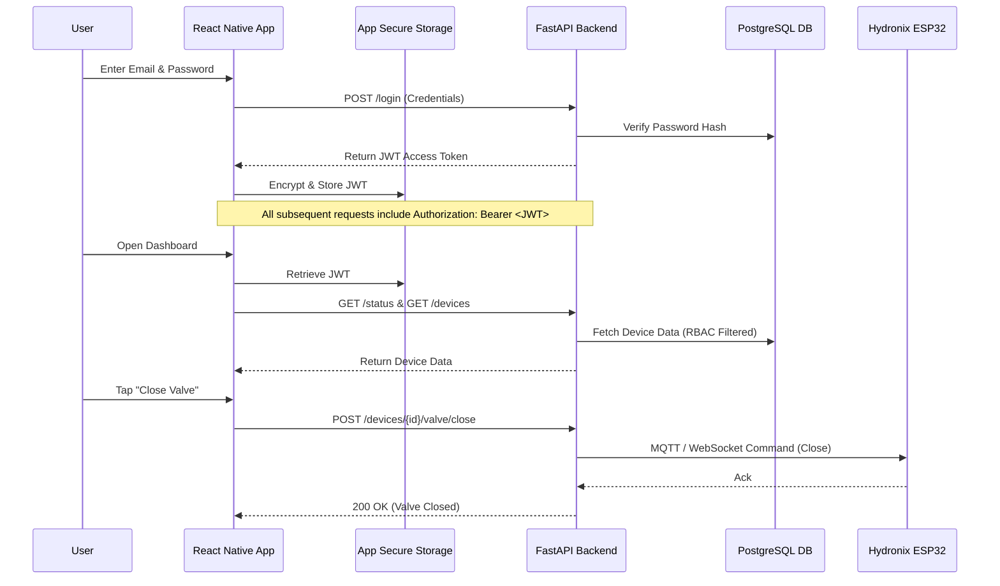

# Mobile App Implementation Plan for Hydronix

The goal of this plan is to create a robust, highly secure, and aesthetically pleasing React Native mobile application for the Hydronix project. The app will allow users to securely authenticate, monitor their water quality sensors on the go, receive alerts, and remotely control device valves.

## Architecture Diagram

The following diagram illustrates the flow of data and authentication between the React Native mobile app, the FastAPI backend, and the physical devices.

## Security Posture (Preventing Hackers)

To ensure the mobile app and backend are protected against malicious actors, the following security controls will be strictly enforced:

### 1. Secure Authentication & Storage
- **JWT Storage**: The JSON Web Token (JWT) returned from the backend will *never* be stored in plaintext (e.g., `AsyncStorage`). Instead, it will be stored using **Expo SecureStore** (which utilizes the iOS Keychain and Android Keystore) to ensure AES encryption at rest.
- **Biometric Prompt**: Sensitive actions (like toggling a valve) will strictly require FaceID / Fingerprint authentication before executing the API call to add an extra layer of security.

### 2. Network Security
- **Strict HTTPS**: The app will reject any plain HTTP connections. All communication will go over HTTPS (TLS 1.2 or 1.3).
- **Certificate Pinning**: To prevent Man-In-The-Middle (MITM) attacks, we will explore setting up SSL Certificate Pinning so the app only trusts the specific Cloudflare tunnel certificate of the Hydronix backend.
- **No Hardcoded Secrets**: API keys, backend URLs, or test passwords will not be hardcoded in the source code. They will be injected via `.env` variables during the build process.

### 3. Payload Integrity & Rate Limiting
- **Input Validation**: All inputs (login forms, alert acknowledgements) will be sanitized on the mobile side using libraries like Yup or Zod before transmission.
- **Backend Enforcement**: The FastAPI backend already enforces strict rate-limiting (100 req/min/device, 10k req/hr/IP) and schema validation, mitigating DDoS and injection attempts from compromised app instances.

## Proposed Implementation Details

We will create a new directory `mobile-app/` in the root of the repository to house the React Native application source code using Expo.

### 1. App Initialization
- Framework: **React Native (via Expo)**. Expo provides robust libraries for SecureStore, push notifications, and OTA updates while keeping the development cycle fast.
- Language: **TypeScript** for strict type-checking and catching bugs at compile time.

### 2. Core Directory Structure & Files

#### [NEW] `mobile-app/app/(auth)/login.tsx`
The secure login screen. Users must provide their registered email and password. Upon success, the JWT is stored in SecureStore and the user is navigated to the main dashboard.

#### [NEW] `mobile-app/app/(tabs)/index.tsx` (Dashboard)
The main dashboard screen showing a high-level overview of system status, active devices, and recent alerts. It will hit `GET /status` and `GET /devices`.

#### [NEW] `mobile-app/app/(tabs)/devices.tsx`
A list of all provisioned devices. Tapping a device navigates to a detail screen. Hits `GET /devices`.

#### [NEW] `mobile-app/app/device/[id].tsx`
A detailed view for a specific device. Shows real-time sensor data (pH, turbidity, TDS, temperature, flow rate), quality score, valve status, and a chart of recent readings. It will provide buttons to manually open/close the valve.
Hits:
- `GET /data/:device_id`
- `GET /devices/:device_id/valve/status`
- `POST /devices/:device_id/valve/close` & `open`

#### [NEW] `mobile-app/app/(tabs)/alerts.tsx`
A list of pending or acknowledged alerts. Users with Operator/Admin roles can acknowledge alerts from here.
Hits:
- `GET /alerts`
- `POST /alerts/:id/acknowledge`

#### [NEW] `mobile-app/src/api/hydronixClient.ts`
A centralized Axios client configured to talk to the Hydronix FastAPI backend.
- **Security Feature**: An Axios interceptor will automatically fetch the JWT from SecureStore and append it to the `Authorization: Bearer` header of every outgoing request. If a `401 Unauthorized` is returned, it will trigger a logout flow.

#### [NEW] `mobile-app/src/theme/colors.ts`
A premium, modern design system utilizing the **Wisteria bloom** color palette. This palette will ensure the app looks professional, engaging, and highly aesthetic:
- **Primary / Brand**: `#9400D3` (Vibrant Purple) - Used for primary buttons, active tabs, and key highlights.
- **Secondary / Accents**: `#ED80E9` (Light Magenta) - Used for secondary badges, toggle states, or accent highlights.
- **Background Tints / Surfaces**: `#D3D3FF` (Light Blue/Purple) & `#D8BFD8` (Pale Purple) - Used for card backgrounds, headers, and subtle UI surfaces.

We will pair this palette with a clean, modern UI (e.g., subtle drop shadows, rounded corners, and potentially glassmorphism effects) to create a premium feel.

## Verification Plan

### Automated Tests
- Run `npm test` within the `mobile-app` directory (using Jest and React Native Testing Library) to verify core component rendering, login form validation, and secure API client logic.

### Manual Verification
- Start the Expo development server (`npx expo start`).
- Boot an Android Emulator or iOS Simulator and verify the login flow using a test user account.
- Verify that the JWT is correctly persisted between app restarts.
- Verify API connectivity by connecting the app to a running instance of the Hydronix backend.
- Test acknowledging an alert and toggling a device valve from the mobile interface.
- Inspect network requests using React Native Debugger or Flipper to ensure the Bearer token is properly attached and no plaintext secrets are leaking.
