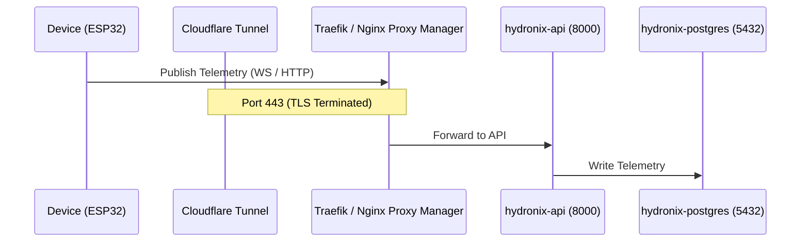

# TrueNAS SCALE Production Hardening & Deployment Specification

This document details the production security audit, deployment checklist, secrets management roadmap, and ZFS storage policies for deploying the **Hydronix Water Monitoring Platform** on **TrueNAS SCALE** via **Portainer Stack** (Docker Compose) using a **Cloudflare Tunnel** and **Nginx Proxy Manager / Traefik**.

---

## 1. Security Audit of Previous Configuration

An audit of the baseline development environment variables reveals several critical issues that must be addressed for a production deployment:

1.  **Hardcoded Credentials**: The default settings used `hydronix` and `hydronix_pass` for PostgreSQL, and `hydronix_local_key` for ML API authorization. These must be replaced with dynamically injected, high-entropy random secrets.
2.  **Localhost bindings (`localhost` references)**: Several configurations relied on `localhost` endpoints. In a production multi-service Docker context, containers must communicate via their virtual network DNS aliases (e.g. `hydronix-redis`, `hydronix-postgres`).
3.  **Permissive CORS**: CORS origins were configured to allow all (`"*"`) hosts. This exposes the API endpoints to unauthorized cross-origin requests. It must be locked to the exact production dashboard domains.
4.  **Lack of Resource Allocations**: Containers lacked CPU and memory resource bounds, making the host vulnerable to resource exhaustion (e.g., during database locks or heavy ML inference loops).
5.  **Exposed Storage Interfaces**: Services like PostgreSQL, Redis, and MinIO bound their ports externally. In production, these should only communicate inside a private Docker bridge network, with external access restricted to Nginx and MQTT.

---

## 2. Missing Environment Variables List

To support production features, the following variables have been introduced:

*   **Localization**: `TZ=Asia/Kolkata` ensures consistent timestamps across sensor data ingestion, database records, logs, and scheduled reports.
*   **Security Flags**:
    *   `REGISTRATION_ENABLED=false` disables the creation of new administrator accounts from the public web page.
    *   `PUBLIC_DASHBOARD_ENABLED=true` exposes public read-only views for device status lists and telemetry scores without requiring JWT tokens.
*   **Scale Limits**: `POSTGRES_POOL_SIZE=20` and `POSTGRES_MAX_OVERFLOW=10` fine-tune database connection pooling to handle heavy, concurrent sensor writes.
*   **Retention Bounds**: `RETENTION_RAW_DATA_DAYS=90` instructs the backend database worker to purge raw, high-resolution sensor metrics older than 90 days after compiling daily aggregates, preventing ZFS disk creep.
*   **Rate Limits**: `RATE_LIMIT_PER_DEVICE_MINUTE=60` and `RATE_LIMIT_PER_IP_HOUR=5000` protect FastAPI endpoints from telemetry spam.

---

## 3. Storage Architecture & TrueNAS-Specific Configuration

TrueNAS SCALE utilizes ZFS filesystems. To achieve optimal performance, replication resilience, and permission handling, map the storage directory `/mnt/tank/docker-data/hydronix/` as follows:

### ZFS Dataset Hierarchy
Create a parent dataset `hydronix` under your docker data pool, then create dedicated nested child datasets for each volume path:

```text
/mnt/tank/docker-data/hydronix/
├── postgres/   # Record Size: 8K (Matches PostgreSQL block size to prevent write amplification)
├── redis/      # Record Size: 128K (Default)
├── minio/      # Record Size: 1M (Optimized for large object file storage)
├── mqtt/       # Record Size: 128K
├── uploads/    # Record Size: 1M (Firmware OTA binaries)
├── reports/    # Record Size: 128K (PDF logs)
├── backups/    # Record Size: 1M (Large daily database dumps; Enable ZSTD compression)
└── logs/       # Record Size: 128K
```

### TrueNAS Permission (ACL) Policies
*   **UID/GID Mapping**: Docker containers run their services under specific non-root users inside the namespace.
    *   **Postgres**: Runs under UID `999` (postgres).
    *   **Mosquitto**: Runs under UID `1883` (mosquitto).
    *   **FastAPI / ML**: Runs under UID `1000`.
*   **Dataset ACL**: In TrueNAS SCALE, edit the ACL permissions of each child dataset to grant **Read/Write/Execute** access to the matching container UIDs, or set ownership to user ID `1000` / group ID `1000` and inherit permissions. Avoid using open `777` permissions.

### Backup and Snapshots
*   **ZFS Snapshot Task**: Schedule a recurring snapshot task on `/mnt/tank/docker-data/hydronix/` daily, retaining snapshots for 14 days. This allows instantaneous rollback in the event of database corruption.
*   **ZFS Replication**: Replicate the daily snapshots off-site to a backup pool or secondary system.

---

## 4. Port Allocation Matrix

Private database and caching systems must remain completely isolated from the host interfaces. Configure Nginx Proxy Manager / Traefik to handle incoming secure HTTP/WS traffic:



| Container Name | Private Network Port | Host Binding Port | Access Bounds | Purpose |
| :--- | :--- | :--- | :--- | :--- |
| `hydronix-nginx` | `80`, `443` | `80`, `443` | **Public** | Routes public HTTP/WS |
| `hydronix-mqtt` | `1883` | `1883` | **Public** | Connects sensor nodes |
| `hydronix-api` | `8000` | None | Private | API core service |
| `hydronix-postgres` | `5432` | None | Private | SQL relational store |
| `hydronix-redis` | `6379` | None | Private | Caching / Rate limits |
| `hydronix-minio` | `9000`, `9001` | None | Private | S3 Object repository |

---

## 5. Secret Management Recommendations

*   **JWT Signing Secrets**: Generate a unique high-entropy key on the deployment shell:
    ```bash
    openssl rand -hex 32
    ```
    Set this key as the `JWT_SECRET` inside your Portainer Stack environment overrides.
*   **Database Passwords**: Do not use simple dictionary words. Use a secure alphanumeric string of at least 24 characters:
    ```bash
    openssl rand -base64 24
    ```
*   **MinIO Root Credentials**: Apply the same high-entropy rules to the Access and Secret keys.
*   **MQTT Bridge Password**: The bridge between MQTT and backend uses internal API routes. Inject a dedicated secure token inside `MQTT_PASSWORD` to authorize the bridge to ingest data.

---

## 6. Production Deployment Checklist

### Phase 1: TrueNAS Setup
*   [ ] Create ZFS datasets under `/mnt/tank/docker-data/hydronix/` matching the directory layouts.
*   [ ] Edit ZFS dataset ownership, allocating permissions for UIDs `999` (Postgres), `1883` (Mosquitto), and `1000` (FastAPI).
*   [ ] Configure TrueNAS snapshot schedules on the parent dataset.

### Phase 2: Portainer Stack Initialization
*   [ ] Open Portainer on TrueNAS SCALE and create a new Stack named `hydronix`.
*   [ ] Copy the production Compose configuration.
*   [ ] Add the hardened environment values from [`.env.example`](file:///c:/Users/harik/OneDrive/Desktop/Git/Thanni-can-poda-vandhan-sir/.env.example) into the Portainer "Environment Variables" editor, providing strong generated secrets.
*   [ ] Deploy the stack.

### Phase 3: Cloudflare & SSL Integration
*   [ ] Connect Cloudflare Tunnel (cloudflared) container to route incoming domains `hydronix.yourdomain.com` and `api.hydronix.yourdomain.com`.
*   [ ] Set up Traefik / Nginx Proxy Manager to forward requests to the Nginx service on ports 80/443.
*   [ ] Inspect backend logs to confirm that the `users` table was initialized and the Superadmin account was seeded on startup.
*   [ ] Run [run_smoke_tests.py](file:///c:/Users/harik/OneDrive/Desktop/Git/Thanni-can-poda-vandhan-sir/run_smoke_tests.py) to check that the entire service stack is fully verified and functional.
